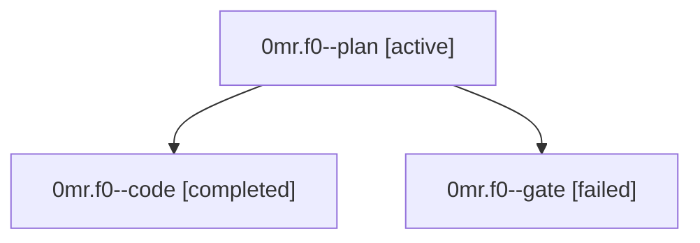

# Family: 0mr.f0

[Agent Hoods](../README.md) / [bbugyi200](../users/bbugyi200/README.md) / [athena](../users/bbugyi200/machines/athena/README.md) / [0mr](../users/bbugyi200/machines/athena/hoods/0mr/README.md) / 0mr.f0

Owner: `bbugyi200.athena` · Hood: `0mr` · Members: 3

## Lineage

The diagram is an optional enhancement; the ordered table below contains the same lineage in accessible text.

| Role | Agent | State | Model / provider | Timing | Commits | Prompt | Chat |
|---|---|---|---|---|---:|---|---|
| plan | 0mr.f0--plan | active | gpt-5.6-sol / codex | 2026-09-18T12:41:14.729217+00:00 | 0 | [Prompt](../agents/bbugyi200.athena.0mr.f0--plan/prompt.md) | [Chat](../agents/bbugyi200.athena.0mr.f0--plan/chat.md) |
| code | 0mr.f0--code | completed | gpt-5.5 / codex | 2026-09-18T12:49:03.142013+00:00 → 2026-09-18T13:37:23.232312+00:00 | [1](../agents/bbugyi200.athena.0mr.f0--code/README.md#commits) | [Prompt](../agents/bbugyi200.athena.0mr.f0--code/prompt.md) | [Chat](../agents/bbugyi200.athena.0mr.f0--code/chat.md) |
| gate | 0mr.f0--gate | failed | gpt-5.6-sol / codex | 2026-09-18T12:47:29.308502+00:00 → 2026-09-18T12:48:33.646088+00:00 | 0 | — | [Chat](../agents/bbugyi200.athena.0mr.f0--gate/chat.md) |

## Commits

| Role | Repo | Commit | Subject | Committed |
|---|---|---|---|---|
| code | sase | [`abfa4c8`](https://github.com/sase-org/sase/commit/abfa4c89d176d7cea735bbbfef74c4e730e3a4cb) | fix(screenshot): include renderer in runtime deps | 2026-09-18 09:34:53 EDT |

## Neighbors

| Agent | Relation | State |
|---|---|---|
| [0mr](bbugyi200.athena.0mr.md) (family · 3) | ancestor | active 1, completed 1, failed 1 |
