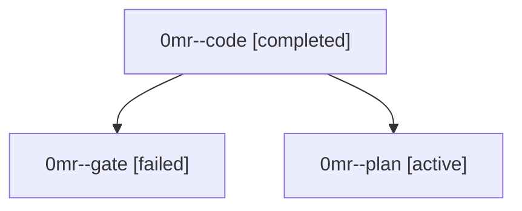

# Family: 0mr

[Agent Hoods](../README.md) / [bbugyi200](../users/bbugyi200/README.md) / [athena](../users/bbugyi200/machines/athena/README.md) / [0mr](../users/bbugyi200/machines/athena/hoods/0mr/README.md) / 0mr

Owner: `bbugyi200.athena` · Hood: `0mr` · Members: 3

## Lineage

The diagram is an optional enhancement; the ordered table below contains the same lineage in accessible text.

| Role | Agent | State | Model / provider | Timing | Commits | Prompt | Chat |
|---|---|---|---|---|---:|---|---|
| code | 0mr--code | completed | gpt-5.5 / codex | 2026-09-18T12:02:09.845495+00:00 → 2026-09-18T12:36:47.751622+00:00 | [1](../agents/bbugyi200.athena.0mr--code/README.md#commits) | [Prompt](../agents/bbugyi200.athena.0mr--code/prompt.md) | [Chat](../agents/bbugyi200.athena.0mr--code/chat.md) |
| gate | 0mr--gate | failed | gpt-6-astra / codex | 2026-09-18T12:00:36.116318+00:00 → 2026-09-18T12:01:37.230735+00:00 | 0 | — | [Chat](../agents/bbugyi200.athena.0mr--gate/chat.md) |
| plan | 0mr--plan | active | gpt-6-astra / codex | 2026-09-18T11:49:45.921231+00:00 | 0 | [Prompt](../agents/bbugyi200.athena.0mr--plan/prompt.md) | [Chat](../agents/bbugyi200.athena.0mr--plan/chat.md) |

## Commits

| Role | Repo | Commit | Subject | Committed |
|---|---|---|---|---|
| code | sase | [`951b7c9`](https://github.com/sase-org/sase/commit/951b7c90687c1656bfbd58a56d6e66a5f168a090) | fix(screenshot): settle live captures and clean tmux bootstrap | 2026-09-18 08:33:49 EDT |

## Neighbors

| Agent | Relation | State |
|---|---|---|
| [0mr.f0](bbugyi200.athena.0mr.f0.md) (family · 3) | descendant | active 1, completed 1, failed 1 |
