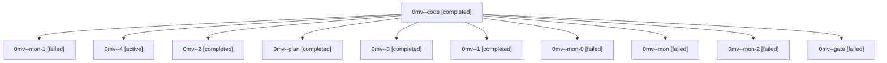

# Family: 0mv

[Agent Hoods](../README.md) / [bbugyi200](../users/bbugyi200/README.md) / [athena](../users/bbugyi200/machines/athena/README.md) / [0mv](../users/bbugyi200/machines/athena/hoods/0mv/README.md) / 0mv

Owner: `bbugyi200.athena` · Hood: `0mv` · Members: 11

## Lineage

The diagram is an optional enhancement; the ordered table below contains the same lineage in accessible text.

| Role | Agent | State | Model / provider | Timing | Commits | Prompt | Chat |
|---|---|---|---|---|---:|---|---|
| code | 0mv--code | completed | grok-4.6 / grok | 2026-09-18T13:41:07.338748+00:00 → 2026-09-18T14:26:27.697915+00:00 | 0 | [Prompt](../agents/bbugyi200.athena.0mv--code/prompt.md) | [Chat](../agents/bbugyi200.athena.0mv--code/chat.md) |
| mon-1 | 0mv--mon-1 | failed | grok-4.6 / grok | 2026-09-18T14:56:10.923158+00:00 → 2026-09-18T15:36:34.088667+00:00 | 0 | — | [Chat](../agents/bbugyi200.athena.0mv--mon-1/chat.md) |
| 4 | 0mv--4 | active | grok-4.6 / grok | 2026-09-18T16:23:21.910944+00:00 | [1](../agents/bbugyi200.athena.0mv--4/README.md#commits) | [Prompt](../agents/bbugyi200.athena.0mv--4/prompt.md) | — |
| 2 | 0mv--2 | completed | grok-4.6 / grok | 2026-09-18T14:50:02.618241+00:00 → 2026-09-18T14:57:15.082646+00:00 | 0 | [Prompt](../agents/bbugyi200.athena.0mv--2/prompt.md) | [Chat](../agents/bbugyi200.athena.0mv--2/chat.md) |
| plan | 0mv--plan | completed | gpt-6-astra / codex | 2026-09-18T13:29:57.107377+00:00 → 2026-09-18T13:38:35.121890+00:00 | 0 | [Prompt](../agents/bbugyi200.athena.0mv--plan/prompt.md) | [Chat](../agents/bbugyi200.athena.0mv--plan/chat.md) |
| 3 | 0mv--3 | completed | grok-4.6 / grok | 2026-09-18T15:36:45.313623+00:00 → 2026-09-18T15:51:25.921994+00:00 | 0 | [Prompt](../agents/bbugyi200.athena.0mv--3/prompt.md) | [Chat](../agents/bbugyi200.athena.0mv--3/chat.md) |
| 1 | 0mv--1 | completed | grok-4.6 / grok | 2026-09-18T14:36:59.627655+00:00 → 2026-09-18T14:42:39.388762+00:00 | 0 | [Prompt](../agents/bbugyi200.athena.0mv--1/prompt.md) | [Chat](../agents/bbugyi200.athena.0mv--1/chat.md) |
| mon-0 | 0mv--mon-0 | failed | grok-4.6 / grok | 2026-09-18T14:41:55.106099+00:00 → 2026-09-18T14:50:00.212032+00:00 | 0 | — | [Chat](../agents/bbugyi200.athena.0mv--mon-0/chat.md) |
| mon | 0mv--mon | failed | grok-4.6 / grok | 2026-09-18T14:25:57.612011+00:00 → 2026-09-18T14:36:53.649941+00:00 | 0 | — | [Chat](../agents/bbugyi200.athena.0mv--mon/chat.md) |
| mon-2 | 0mv--mon-2 | failed | grok-4.6 / grok | 2026-09-18T15:50:52.652839+00:00 → 2026-09-18T16:23:05.591806+00:00 | 0 | — | [Chat](../agents/bbugyi200.athena.0mv--mon-2/chat.md) |
| gate | 0mv--gate | failed | gpt-6-astra / codex | 2026-09-18T13:39:38.557106+00:00 → 2026-09-18T13:40:39.621993+00:00 | 0 | — | [Chat](../agents/bbugyi200.athena.0mv--gate/chat.md) |

## Commits

| Role | Repo | Commit | Subject | Committed |
|---|---|---|---|---|
| 4 | sase | [`a602105`](https://github.com/sase-org/sase/commit/a60210501689a9bf1f9cb35b7826c3704155816f) | feat(finalizers): continue remaining repos after conflict repair | 2026-09-18 12:26:19 EDT |
