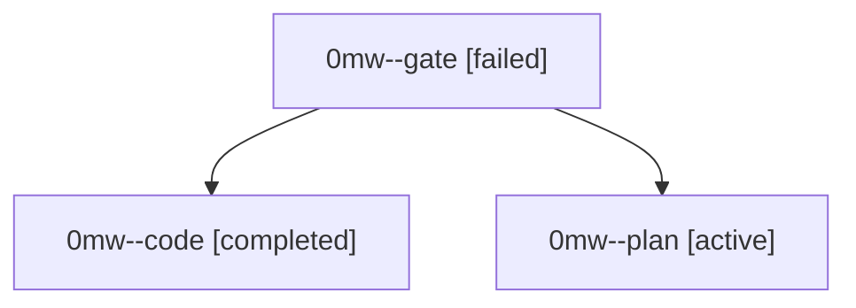

# Family: 0mw

[Agent Hoods](../README.md) / [bbugyi200](../users/bbugyi200/README.md) / [athena](../users/bbugyi200/machines/athena/README.md) / [0mw](../users/bbugyi200/machines/athena/hoods/0mw/README.md) / 0mw

Owner: `bbugyi200.athena` · Hood: `0mw` · Members: 3

## Lineage

The diagram is an optional enhancement; the ordered table below contains the same lineage in accessible text.

| Role | Agent | State | Model / provider | Timing | Commits | Prompt | Chat |
|---|---|---|---|---|---:|---|---|
| gate | 0mw--gate | failed | gpt-5.6-sol / codex | 2026-09-18T13:41:19.032295+00:00 → 2026-09-18T13:42:13.651449+00:00 | 0 | — | [Chat](../agents/bbugyi200.athena.0mw--gate/chat.md) |
| code | 0mw--code | completed | gpt-5.5 / codex | 2026-09-18T13:42:46.164014+00:00 → 2026-09-18T14:48:39.542094+00:00 | [1](../agents/bbugyi200.athena.0mw--code/README.md#commits) | [Prompt](../agents/bbugyi200.athena.0mw--code/prompt.md) | [Chat](../agents/bbugyi200.athena.0mw--code/chat.md) |
| plan | 0mw--plan | active | gpt-5.6-sol / codex | 2026-09-18T13:32:14.490326+00:00 | 0 | [Prompt](../agents/bbugyi200.athena.0mw--plan/prompt.md) | [Chat](../agents/bbugyi200.athena.0mw--plan/chat.md) |

## Commits

| Role | Repo | Commit | Subject | Committed |
|---|---|---|---|---|
| code | sase | [`cd7b9f9`](https://github.com/sase-org/sase/commit/cd7b9f9fd81ced823ff93e48733450885e813cdb) | fix(sdd): publish sidecar clones atomically | 2026-09-18 10:45:43 EDT |
