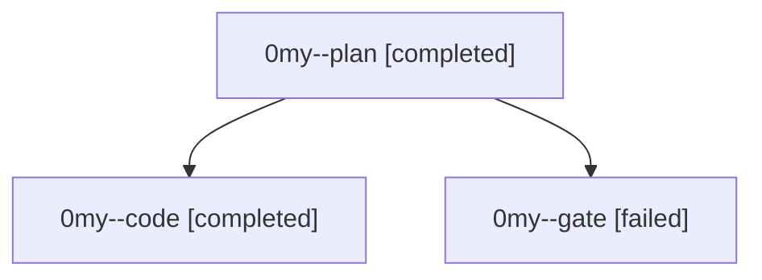

# Family: 0my

[Agent Hoods](../README.md) / [bbugyi200](../users/bbugyi200/README.md) / [athena](../users/bbugyi200/machines/athena/README.md) / [0my](../users/bbugyi200/machines/athena/hoods/0my/README.md) / 0my

Owner: `bbugyi200.athena` · Hood: `0my` · Members: 3

## Lineage

The diagram is an optional enhancement; the ordered table below contains the same lineage in accessible text.

| Role | Agent | State | Model / provider | Timing | Commits | Prompt | Chat |
|---|---|---|---|---|---:|---|---|
| plan | 0my--plan | completed | gpt-6-astra / codex | 2026-09-18T14:38:08.482765+00:00 → 2026-09-18T14:43:30.873560+00:00 | 0 | [Prompt](../agents/bbugyi200.athena.0my--plan/prompt.md) | [Chat](../agents/bbugyi200.athena.0my--plan/chat.md) |
| code | 0my--code | completed | gpt-5.5 / codex | 2026-09-18T14:46:02.627352+00:00 → 2026-09-18T15:27:36.713021+00:00 | [1](../agents/bbugyi200.athena.0my--code/README.md#commits) | [Prompt](../agents/bbugyi200.athena.0my--code/prompt.md) | [Chat](../agents/bbugyi200.athena.0my--code/chat.md) |
| gate | 0my--gate | failed | gpt-6-astra / codex | 2026-09-18T14:43:47.752217+00:00 → 2026-09-18T14:45:25.042404+00:00 | 0 | — | [Chat](../agents/bbugyi200.athena.0my--gate/chat.md) |

## Commits

| Role | Repo | Commit | Subject | Committed |
|---|---|---|---|---|
| code | sase | [`a255fc7`](https://github.com/sase-org/sase/commit/a255fc75a0449a083b578cac51885a8ea10e5337) | fix(screenshot): support remote login shell capture | 2026-09-18 11:24:15 EDT |
