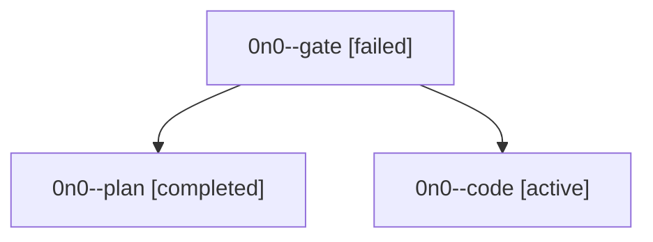

# Family: 0n0

[Agent Hoods](../README.md) / [bbugyi200](../users/bbugyi200/README.md) / [athena](../users/bbugyi200/machines/athena/README.md) / [0n0](../users/bbugyi200/machines/athena/hoods/0n0/README.md) / 0n0

Owner: `bbugyi200.athena` · Hood: `0n0` · Members: 3

## Lineage

The diagram is an optional enhancement; the ordered table below contains the same lineage in accessible text.

| Role | Agent | State | Model / provider | Timing | Commits | Prompt | Chat |
|---|---|---|---|---|---:|---|---|
| gate | 0n0--gate | failed | gpt-6-astra / codex | 2026-09-18T17:12:53.483775+00:00 → 2026-09-18T17:13:53.651722+00:00 | 0 | — | [Chat](../agents/bbugyi200.athena.0n0--gate/chat.md) |
| plan | 0n0--plan | completed | gpt-6-astra / codex | 2026-09-18T16:59:25.430412+00:00 → 2026-09-18T17:08:50.770009+00:00 | 0 | [Prompt](../agents/bbugyi200.athena.0n0--plan/prompt.md) | [Chat](../agents/bbugyi200.athena.0n0--plan/chat.md) |
| code | 0n0--code | active | grok-4.6 / grok | 2026-09-18T17:14:39.370825+00:00 | [1](../agents/bbugyi200.athena.0n0--code/README.md#commits) | [Prompt](../agents/bbugyi200.athena.0n0--code/prompt.md) | — |

## Commits

| Role | Repo | Commit | Subject | Committed |
|---|---|---|---|---|
| code | sase | [`3962d88`](https://github.com/sase-org/sase/commit/3962d8819731d9e35f1834f3a9608b9deac539d8) | fix(tui): isolate agent row graphs during background refresh | 2026-09-18 14:09:27 EDT |
