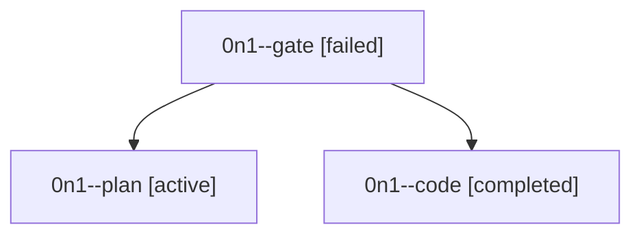

# Family: 0n1

[Agent Hoods](../README.md) / [bbugyi200](../users/bbugyi200/README.md) / [athena](../users/bbugyi200/machines/athena/README.md) / [0n1](../users/bbugyi200/machines/athena/hoods/0n1/README.md) / 0n1

Owner: `bbugyi200.athena` · Hood: `0n1` · Members: 3

## Lineage

The diagram is an optional enhancement; the ordered table below contains the same lineage in accessible text.

| Role | Agent | State | Model / provider | Timing | Commits | Prompt | Chat |
|---|---|---|---|---|---:|---|---|
| gate | 0n1--gate | failed | gpt-6-astra / codex | 2026-09-18T17:47:58.853882+00:00 → 2026-09-18T17:48:57.436575+00:00 | 0 | — | [Chat](../agents/bbugyi200.athena.0n1--gate/chat.md) |
| plan | 0n1--plan | active | gpt-6-astra / codex | 2026-09-18T17:41:35.204675+00:00 | 0 | [Prompt](../agents/bbugyi200.athena.0n1--plan/prompt.md) | [Chat](../agents/bbugyi200.athena.0n1--plan/chat.md) |
| code | 0n1--code | completed | gpt-5.5 / codex | 2026-09-18T17:49:25.885648+00:00 → 2026-09-18T18:06:16.533121+00:00 | [1](../agents/bbugyi200.athena.0n1--code/README.md#commits) | [Prompt](../agents/bbugyi200.athena.0n1--code/prompt.md) | [Chat](../agents/bbugyi200.athena.0n1--code/chat.md) |

## Commits

| Role | Repo | Commit | Subject | Committed |
|---|---|---|---|---|
| code | sase | [`58024dc`](https://github.com/sase-org/sase/commit/58024dca7492d7ad6ba70864f5145ef143da17c0) | fix(tui): preserve clan member status labels | 2026-09-18 14:03:15 EDT |
