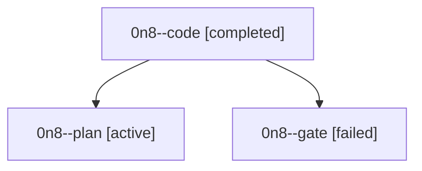

# Family: 0n8

[Agent Hoods](../README.md) / [bbugyi200](../users/bbugyi200/README.md) / [athena](../users/bbugyi200/machines/athena/README.md) / [0n8](../users/bbugyi200/machines/athena/hoods/0n8/README.md) / 0n8

Owner: `bbugyi200.athena` · Hood: `0n8` · Members: 3

## Lineage

The diagram is an optional enhancement; the ordered table below contains the same lineage in accessible text.

| Role | Agent | State | Model / provider | Timing | Commits | Prompt | Chat |
|---|---|---|---|---|---:|---|---|
| code | 0n8--code | completed | grok-4.6 / grok | 2026-09-18T19:20:29.415217+00:00 → 2026-09-18T20:10:27.323634+00:00 | [1](../agents/bbugyi200.athena.0n8--code/README.md#commits) | [Prompt](../agents/bbugyi200.athena.0n8--code/prompt.md) | [Chat](../agents/bbugyi200.athena.0n8--code/chat.md) |
| plan | 0n8--plan | active | gpt-5.6-sol / codex | 2026-09-18T19:06:57.221083+00:00 | 0 | [Prompt](../agents/bbugyi200.athena.0n8--plan/prompt.md) | [Chat](../agents/bbugyi200.athena.0n8--plan/chat.md) |
| gate | 0n8--gate | failed | gpt-5.6-sol / codex | 2026-09-18T19:18:57.925736+00:00 → 2026-09-18T19:19:56.561267+00:00 | 0 | — | [Chat](../agents/bbugyi200.athena.0n8--gate/chat.md) |

## Commits

| Role | Repo | Commit | Subject | Committed |
|---|---|---|---|---|
| code | sase | [`571039e`](https://github.com/sase-org/sase/commit/571039e118dd647ec1d5c9d291c4f4a9f0051195) | feat(tui): accept prompt completions with Ctrl+G instead of Enter | 2026-09-18 16:07:06 EDT |

## Neighbors

| Agent | Relation | State |
|---|---|---|
| [0n8.f0](../agents/bbugyi200.athena.0n8.f0/README.md) | descendant | active |
