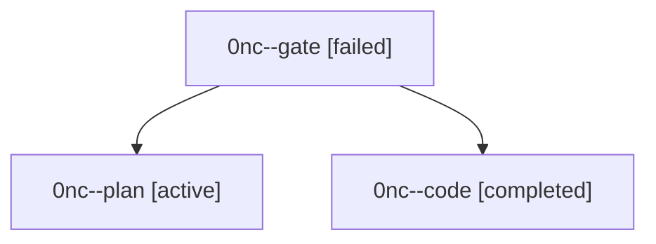

# Family: 0nc

[Agent Hoods](../README.md) / [bbugyi200](../users/bbugyi200/README.md) / [athena](../users/bbugyi200/machines/athena/README.md) / [0nc](../users/bbugyi200/machines/athena/hoods/0nc/README.md) / 0nc

Owner: `bbugyi200.athena` · Hood: `0nc` · Members: 3

## Lineage

The diagram is an optional enhancement; the ordered table below contains the same lineage in accessible text.

| Role | Agent | State | Model / provider | Timing | Commits | Prompt | Chat |
|---|---|---|---|---|---:|---|---|
| gate | 0nc--gate | failed | gpt-5.6-sol / codex | 2026-09-18T22:40:34.249620+00:00 → 2026-09-18T22:42:21.040370+00:00 | 0 | — | [Chat](../agents/bbugyi200.athena.0nc--gate/chat.md) |
| plan | 0nc--plan | active | gpt-5.6-sol / codex | 2026-09-18T22:32:09.919101+00:00 | 0 | [Prompt](../agents/bbugyi200.athena.0nc--plan/prompt.md) | [Chat](../agents/bbugyi200.athena.0nc--plan/chat.md) |
| code | 0nc--code | completed | gpt-5.5 / codex | 2026-09-18T22:43:03.937846+00:00 → 2026-09-19T03:08:32.542932+00:00 | [1](../agents/bbugyi200.athena.0nc--code/README.md#commits) | [Prompt](../agents/bbugyi200.athena.0nc--code/prompt.md) | [Chat](../agents/bbugyi200.athena.0nc--code/chat.md) |

## Commits

| Role | Repo | Commit | Subject | Committed |
|---|---|---|---|---|
| code | sase | [`3538713`](https://github.com/sase-org/sase/commit/3538713c0d285883a67abb415c07aa00a02ab5a7) | docs(finalizer): require screenshot golden commits | 2026-09-18 21:19:00 EDT |
| — | sase | [`bdff89d`](https://github.com/sase-org/sase/commit/bdff89d98660f3586e973c5a0dbfae75d0bef2c8) | feat(ace): confirm prompt submission on enter | 2026-09-18 23:04:12 EDT |
