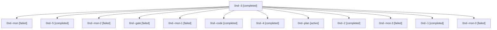

# Family: 0nd

[Agent Hoods](../README.md) / [bbugyi200](../users/bbugyi200/README.md) / [athena](../users/bbugyi200/machines/athena/README.md) / [0nd](../users/bbugyi200/machines/athena/hoods/0nd/README.md) / 0nd

Owner: `bbugyi200.athena` · Hood: `0nd` · Members: 13

## Lineage

The diagram is an optional enhancement; the ordered table below contains the same lineage in accessible text.

| Role | Agent | State | Model / provider | Timing | Commits | Prompt | Chat |
|---|---|---|---|---|---:|---|---|
| 3 | 0nd--3 | completed | grok-4.6 / grok | 2026-09-19T03:01:39.665890+00:00 → 2026-09-19T03:12:26.630043+00:00 | 0 | [Prompt](../agents/bbugyi200.athena.0nd--3/prompt.md) | [Chat](../agents/bbugyi200.athena.0nd--3/chat.md) |
| mon | 0nd--mon | failed | grok-4.6 / grok | 2026-09-19T00:29:07.139389+00:00 → 2026-09-19T01:06:28.634340+00:00 | 0 | — | [Chat](../agents/bbugyi200.athena.0nd--mon/chat.md) |
| 5 | 0nd--5 | completed | grok-4.6 / grok | 2026-09-19T04:22:05.241356+00:00 → 2026-09-19T05:05:24.881234+00:00 | [1](../agents/bbugyi200.athena.0nd--5/README.md#commits) | [Prompt](../agents/bbugyi200.athena.0nd--5/prompt.md) | [Chat](../agents/bbugyi200.athena.0nd--5/chat.md) |
| mon-2 | 0nd--mon-2 | failed | grok-4.6 / grok | 2026-09-19T03:11:51.305082+00:00 → 2026-09-19T03:41:59.689961+00:00 | 0 | — | [Chat](../agents/bbugyi200.athena.0nd--mon-2/chat.md) |
| gate | 0nd--gate | failed | grok-4.6 / grok | 2026-09-18T23:16:22.884167+00:00 → 2026-09-18T23:19:14.521154+00:00 | 0 | — | [Chat](../agents/bbugyi200.athena.0nd--gate/chat.md) |
| mon-1 | 0nd--mon-1 | failed | grok-4.6 / grok | 2026-09-19T02:14:28.293819+00:00 → 2026-09-19T03:01:16.294645+00:00 | 0 | — | [Chat](../agents/bbugyi200.athena.0nd--mon-1/chat.md) |
| code | 0nd--code | completed | grok-4.6 / grok | 2026-09-18T23:59:45.337402+00:00 → 2026-09-19T00:29:58.777833+00:00 | 0 | [Prompt](../agents/bbugyi200.athena.0nd--code/prompt.md) | [Chat](../agents/bbugyi200.athena.0nd--code/chat.md) |
| 4 | 0nd--4 | completed | grok-4.6 / grok | 2026-09-19T03:42:13.011220+00:00 → 2026-09-19T03:56:56.456417+00:00 | 0 | [Prompt](../agents/bbugyi200.athena.0nd--4/prompt.md) | [Chat](../agents/bbugyi200.athena.0nd--4/chat.md) |
| plan | 0nd--plan | active | grok-4.6 / grok | 2026-09-18T23:02:17.373671+00:00 | 0 | [Prompt](../agents/bbugyi200.athena.0nd--plan/prompt.md) | [Chat](../agents/bbugyi200.athena.0nd--plan/chat.md) |
| 2 | 0nd--2 | completed | grok-4.6 / grok | 2026-09-19T02:05:04.185880+00:00 → 2026-09-19T02:16:20.241516+00:00 | 0 | [Prompt](../agents/bbugyi200.athena.0nd--2/prompt.md) | [Chat](../agents/bbugyi200.athena.0nd--2/chat.md) |
| mon-3 | 0nd--mon-3 | failed | grok-4.6 / grok | 2026-09-19T03:54:47.865666+00:00 → 2026-09-19T04:21:48.492766+00:00 | 0 | — | [Chat](../agents/bbugyi200.athena.0nd--mon-3/chat.md) |
| 1 | 0nd--1 | completed | grok-4.6 / grok | 2026-09-19T01:06:47.296608+00:00 → 2026-09-19T01:24:52.031650+00:00 | 0 | [Prompt](../agents/bbugyi200.athena.0nd--1/prompt.md) | [Chat](../agents/bbugyi200.athena.0nd--1/chat.md) |
| mon-0 | 0nd--mon-0 | failed | grok-4.6 / grok | 2026-09-19T01:23:23.525981+00:00 → 2026-09-19T02:04:36.253224+00:00 | 0 | — | [Chat](../agents/bbugyi200.athena.0nd--mon-0/chat.md) |

## Commits

| Role | Repo | Commit | Subject | Committed |
|---|---|---|---|---|
| 5 | sase | [`17084a6`](https://github.com/sase-org/sase/commit/17084a6e275a5c3dfe12018595dc118a889a8176) | feat(llm-provider): retune shipped size aliases onto Codex luna and terra | 2026-09-19 01:01:08 EDT |
