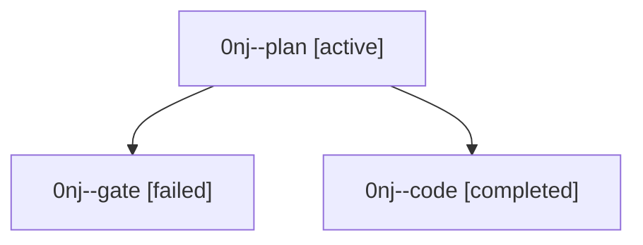

# Family: 0nj

[Agent Hoods](../README.md) / [bbugyi200](../users/bbugyi200/README.md) / [athena](../users/bbugyi200/machines/athena/README.md) / [0nj](../users/bbugyi200/machines/athena/hoods/0nj/README.md) / 0nj

Owner: `bbugyi200.athena` · Hood: `0nj` · Members: 3

## Lineage

The diagram is an optional enhancement; the ordered table below contains the same lineage in accessible text.

| Role | Agent | State | Model / provider | Timing | Commits | Prompt | Chat |
|---|---|---|---|---|---:|---|---|
| plan | 0nj--plan | active | gpt-5.6-sol / codex | 2026-09-19T01:55:56.136568+00:00 | 0 | [Prompt](../agents/bbugyi200.athena.0nj--plan/prompt.md) | [Chat](../agents/bbugyi200.athena.0nj--plan/chat.md) |
| gate | 0nj--gate | failed | gpt-5.6-sol / codex | 2026-09-19T02:07:00.226066+00:00 → 2026-09-19T02:08:06.471414+00:00 | 0 | — | [Chat](../agents/bbugyi200.athena.0nj--gate/chat.md) |
| code | 0nj--code | completed | grok-4.6 / grok | 2026-09-19T02:08:40.519982+00:00 → 2026-09-19T03:29:47.823057+00:00 | [1](../agents/bbugyi200.athena.0nj--code/README.md#commits) | [Prompt](../agents/bbugyi200.athena.0nj--code/prompt.md) | [Chat](../agents/bbugyi200.athena.0nj--code/chat.md) |

## Commits

| Role | Repo | Commit | Subject | Committed |
|---|---|---|---|---|
| code | sase | [`d4c0287`](https://github.com/sase-org/sase/commit/d4c0287725a504ff308e0a83f62fea3b639f04b1) | fix(sudo): resolve remote sase through the login shell | 2026-09-18 23:26:10 EDT |
