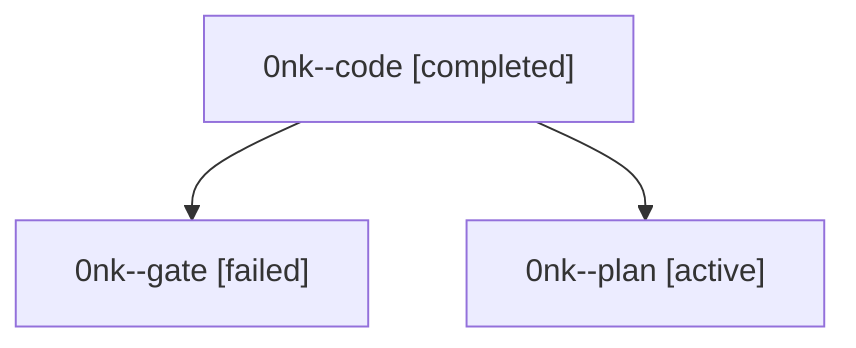

# Family: 0nk

[Agent Hoods](../README.md) / [bbugyi200](../users/bbugyi200/README.md) / [athena](../users/bbugyi200/machines/athena/README.md) / [0nk](../users/bbugyi200/machines/athena/hoods/0nk/README.md) / 0nk

Owner: `bbugyi200.athena` · Hood: `0nk` · Members: 3

## Lineage

The diagram is an optional enhancement; the ordered table below contains the same lineage in accessible text.

| Role | Agent | State | Model / provider | Timing | Commits | Prompt | Chat |
|---|---|---|---|---|---:|---|---|
| code | 0nk--code | completed | grok-4.6 / grok | 2026-09-19T02:11:20.922680+00:00 → 2026-09-19T02:58:32.827082+00:00 | [1](../agents/bbugyi200.athena.0nk--code/README.md#commits) | [Prompt](../agents/bbugyi200.athena.0nk--code/prompt.md) | [Chat](../agents/bbugyi200.athena.0nk--code/chat.md) |
| gate | 0nk--gate | failed | gpt-5.6-sol / codex | 2026-09-19T02:07:40.845239+00:00 → 2026-09-19T02:08:43.680331+00:00 | 0 | — | [Chat](../agents/bbugyi200.athena.0nk--gate/chat.md) |
| plan | 0nk--plan | active | gpt-5.6-sol / codex | 2026-09-19T01:56:37.992026+00:00 | 0 | [Prompt](../agents/bbugyi200.athena.0nk--plan/prompt.md) | [Chat](../agents/bbugyi200.athena.0nk--plan/chat.md) |

## Commits

| Role | Repo | Commit | Subject | Committed |
|---|---|---|---|---|
| code | sase | [`a733725`](https://github.com/sase-org/sase/commit/a7337251bd2eb4b141e95e37421185f47533171e) | feat(tui): bulk-select tmux workspaces from the Agents chooser | 2026-09-18 22:54:48 EDT |
