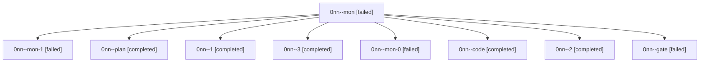

# Family: 0nn

[Agent Hoods](../README.md) / [bbugyi200](../users/bbugyi200/README.md) / [athena](../users/bbugyi200/machines/athena/README.md) / [0nn](../users/bbugyi200/machines/athena/hoods/0nn/README.md) / 0nn

Owner: `bbugyi200.athena` · Hood: `0nn` · Members: 9

## Lineage

The diagram is an optional enhancement; the ordered table below contains the same lineage in accessible text.

| Role | Agent | State | Model / provider | Timing | Commits | Prompt | Chat |
|---|---|---|---|---|---:|---|---|
| mon | 0nn--mon | failed | grok-4.6 / grok | 2026-09-19T12:20:22.009476+00:00 → 2026-09-19T12:30:08.945594+00:00 | 0 | — | [Chat](../agents/bbugyi200.athena.0nn--mon/chat.md) |
| mon-1 | 0nn--mon-1 | failed | grok-4.6 / grok | 2026-09-19T13:52:27.518865+00:00 → 2026-09-19T14:17:47.690987+00:00 | 0 | — | [Chat](../agents/bbugyi200.athena.0nn--mon-1/chat.md) |
| plan | 0nn--plan | completed | grok-4.6 / grok | 2026-09-19T11:30:57.599257+00:00 → 2026-09-19T11:45:51.987618+00:00 | 0 | [Prompt](../agents/bbugyi200.athena.0nn--plan/prompt.md) | [Chat](../agents/bbugyi200.athena.0nn--plan/chat.md) |
| 1 | 0nn--1 | completed | grok-4.6 / grok | 2026-09-19T12:41:31.106443+00:00 → 2026-09-19T12:51:30.292744+00:00 | 0 | [Prompt](../agents/bbugyi200.athena.0nn--1/prompt.md) | [Chat](../agents/bbugyi200.athena.0nn--1/chat.md) |
| 3 | 0nn--3 | completed | grok-4.6 / grok | 2026-09-19T14:29:39.249544+00:00 → 2026-09-19T14:47:29.392669+00:00 | [1](../agents/bbugyi200.athena.0nn--3/README.md#commits) | [Prompt](../agents/bbugyi200.athena.0nn--3/prompt.md) | [Chat](../agents/bbugyi200.athena.0nn--3/chat.md) |
| mon-0 | 0nn--mon-0 | failed | grok-4.6 / grok | 2026-09-19T12:50:55.267497+00:00 → 2026-09-19T13:30:48.373777+00:00 | 0 | — | [Chat](../agents/bbugyi200.athena.0nn--mon-0/chat.md) |
| code | 0nn--code | completed | grok-4.6 / grok | 2026-09-19T12:07:52.737900+00:00 → 2026-09-19T12:20:49.664111+00:00 | 0 | [Prompt](../agents/bbugyi200.athena.0nn--code/prompt.md) | [Chat](../agents/bbugyi200.athena.0nn--code/chat.md) |
| 2 | 0nn--2 | completed | grok-4.6 / grok | 2026-09-19T13:41:46.005424+00:00 → 2026-09-19T13:52:58.101589+00:00 | 0 | [Prompt](../agents/bbugyi200.athena.0nn--2/prompt.md) | [Chat](../agents/bbugyi200.athena.0nn--2/chat.md) |
| gate | 0nn--gate | failed | grok-4.6 / grok | 2026-09-19T11:45:17.686684+00:00 → 2026-09-19T11:56:59.851910+00:00 | 0 | — | [Chat](../agents/bbugyi200.athena.0nn--gate/chat.md) |

## Commits

| Role | Repo | Commit | Subject | Committed |
|---|---|---|---|---|
| 3 | sase | [`37f0651`](https://github.com/sase-org/sase/commit/37f0651d6d115012f4a8ee2b11b4493502155395) | feat(sudo): attach remote authentication ssh to /dev/tty | 2026-09-19 10:46:02 EDT |
