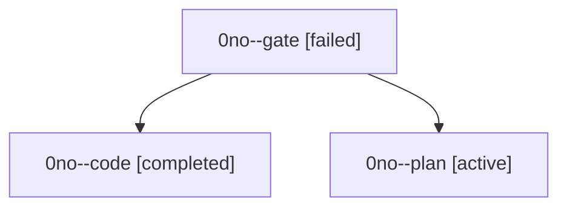

# Family: 0no

[Agent Hoods](../README.md) / [bbugyi200](../users/bbugyi200/README.md) / [athena](../users/bbugyi200/machines/athena/README.md) / [0no](../users/bbugyi200/machines/athena/hoods/0no/README.md) / 0no

Owner: `bbugyi200.athena` · Hood: `0no` · Members: 3

## Lineage

The diagram is an optional enhancement; the ordered table below contains the same lineage in accessible text.

| Role | Agent | State | Model / provider | Timing | Commits | Prompt | Chat |
|---|---|---|---|---|---:|---|---|
| gate | 0no--gate | failed | grok-4.6 / grok | 2026-09-19T12:05:56.581756+00:00 → 2026-09-19T12:10:18.403333+00:00 | 0 | — | [Chat](../agents/bbugyi200.athena.0no--gate/chat.md) |
| code | 0no--code | completed | grok-4.6 / grok | 2026-09-19T12:40:03.162531+00:00 → 2026-09-19T13:40:47.548041+00:00 | [1](../agents/bbugyi200.athena.0no--code/README.md#commits) | [Prompt](../agents/bbugyi200.athena.0no--code/prompt.md) | [Chat](../agents/bbugyi200.athena.0no--code/chat.md) |
| plan | 0no--plan | active | grok-4.6 / grok | 2026-09-19T11:51:07.261303+00:00 | 0 | [Prompt](../agents/bbugyi200.athena.0no--plan/prompt.md) | [Chat](../agents/bbugyi200.athena.0no--plan/chat.md) |

## Commits

| Role | Repo | Commit | Subject | Committed |
|---|---|---|---|---|
| code | sase | [`8d2a39c`](https://github.com/sase-org/sase/commit/8d2a39c5684cf86d774173fcfbaa7dd602e07196) | feat(ace): mirror lone queued clan member admission rank | 2026-09-19 09:36:11 EDT |
