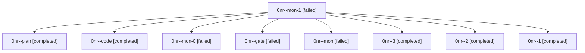

# Family: 0nr

[Agent Hoods](../README.md) / [bbugyi200](../users/bbugyi200/README.md) / [athena](../users/bbugyi200/machines/athena/README.md) / [0nr](../users/bbugyi200/machines/athena/hoods/0nr/README.md) / 0nr

Owner: `bbugyi200.athena` · Hood: `0nr` · Members: 9

## Lineage

The diagram is an optional enhancement; the ordered table below contains the same lineage in accessible text.

| Role | Agent | State | Model / provider | Timing | Commits | Prompt | Chat |
|---|---|---|---|---|---:|---|---|
| mon-1 | 0nr--mon-1 | failed | grok-4.6 / grok | 2026-09-19T16:56:04.101907+00:00 → 2026-09-19T17:01:07.869037+00:00 | 0 | — | [Chat](../agents/bbugyi200.athena.0nr--mon-1/chat.md) |
| plan | 0nr--plan | completed | grok-4.6 / grok | 2026-09-19T13:55:10.341954+00:00 → 2026-09-19T14:15:46.882189+00:00 | 0 | [Prompt](../agents/bbugyi200.athena.0nr--plan/prompt.md) | [Chat](../agents/bbugyi200.athena.0nr--plan/chat.md) |
| code | 0nr--code | completed | grok-4.6 / grok | 2026-09-19T14:42:16.911539+00:00 → 2026-09-19T15:14:38.946612+00:00 | 0 | [Prompt](../agents/bbugyi200.athena.0nr--code/prompt.md) | [Chat](../agents/bbugyi200.athena.0nr--code/chat.md) |
| mon-0 | 0nr--mon-0 | failed | grok-4.6 / grok | 2026-09-19T16:10:58.828766+00:00 → 2026-09-19T16:47:21.076006+00:00 | 0 | — | [Chat](../agents/bbugyi200.athena.0nr--mon-0/chat.md) |
| gate | 0nr--gate | failed | grok-4.6 / grok | 2026-09-19T14:14:40.192855+00:00 → 2026-09-19T14:18:19.494929+00:00 | 0 | — | [Chat](../agents/bbugyi200.athena.0nr--gate/chat.md) |
| mon | 0nr--mon | failed | grok-4.6 / grok | 2026-09-19T15:13:54.967575+00:00 → 2026-09-19T16:00:39.566540+00:00 | 0 | — | [Chat](../agents/bbugyi200.athena.0nr--mon/chat.md) |
| 3 | 0nr--3 | completed | grok-4.6 / grok | 2026-09-19T17:01:24.698345+00:00 → 2026-09-19T17:06:25.851695+00:00 | [1](../agents/bbugyi200.athena.0nr--3/README.md#commits) | [Prompt](../agents/bbugyi200.athena.0nr--3/prompt.md) | [Chat](../agents/bbugyi200.athena.0nr--3/chat.md) |
| 2 | 0nr--2 | completed | grok-4.6 / grok | 2026-09-19T16:50:20.739344+00:00 → 2026-09-19T16:57:16.515565+00:00 | 0 | [Prompt](../agents/bbugyi200.athena.0nr--2/prompt.md) | [Chat](../agents/bbugyi200.athena.0nr--2/chat.md) |
| 1 | 0nr--1 | completed | grok-4.6 / grok | 2026-09-19T16:05:28.133852+00:00 → 2026-09-19T16:11:52.191609+00:00 | 0 | [Prompt](../agents/bbugyi200.athena.0nr--1/prompt.md) | [Chat](../agents/bbugyi200.athena.0nr--1/chat.md) |

## Commits

| Role | Repo | Commit | Subject | Committed |
|---|---|---|---|---|
| 3 | sase | [`d8b8369`](https://github.com/sase-org/sase/commit/d8b8369b7a18683743e61764afd3fe041b1e8b2a) | fix(sdd): skip ephemeral clones during artifact\_link\_backfill reconcile | 2026-09-19 13:03:45 EDT |
