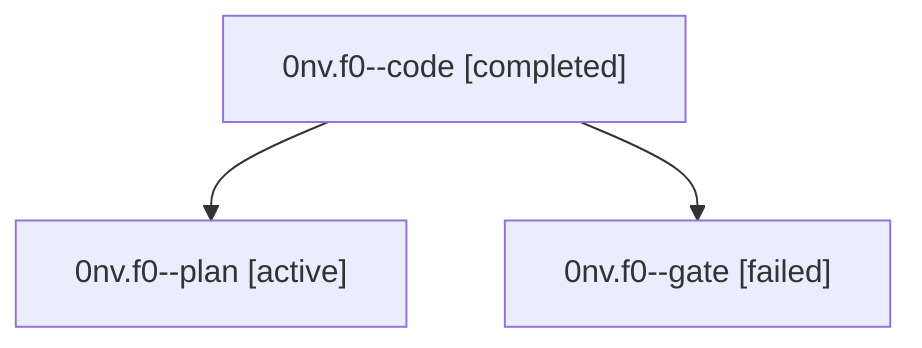

# Family: 0nv.f0

[Agent Hoods](../README.md) / [bbugyi200](../users/bbugyi200/README.md) / [athena](../users/bbugyi200/machines/athena/README.md) / [0nv](../users/bbugyi200/machines/athena/hoods/0nv/README.md) / 0nv.f0

Owner: `bbugyi200.athena` · Hood: `0nv` · Members: 3

## Lineage

The diagram is an optional enhancement; the ordered table below contains the same lineage in accessible text.

| Role | Agent | State | Model / provider | Timing | Commits | Prompt | Chat |
|---|---|---|---|---|---:|---|---|
| code | 0nv.f0--code | completed | sonnet / claude | 2026-09-20T13:53:14.431742+00:00 → 2026-09-20T15:08:41.491675+00:00 | [1](../agents/bbugyi200.athena.0nv.f0--code/README.md#commits) | [Prompt](../agents/bbugyi200.athena.0nv.f0--code/prompt.md) | [Chat](../agents/bbugyi200.athena.0nv.f0--code/chat.md) |
| plan | 0nv.f0--plan | active | opus / claude | 2026-09-20T13:44:16.408315+00:00 | 0 | [Prompt](../agents/bbugyi200.athena.0nv.f0--plan/prompt.md) | [Chat](../agents/bbugyi200.athena.0nv.f0--plan/chat.md) |
| gate | 0nv.f0--gate | failed | opus / claude | 2026-09-20T13:51:46.873616+00:00 → 2026-09-20T13:52:48.967832+00:00 | 0 | — | [Chat](../agents/bbugyi200.athena.0nv.f0--gate/chat.md) |

## Commits

| Role | Repo | Commit | Subject | Committed |
|---|---|---|---|---|
| code | sase | [`624a29e`](https://github.com/sase-org/sase/commit/624a29ea72d443a257a4326ef5209baa73bb5e03) | fix(service): decide git readiness from remote auth and preflight plan approvals | 2026-09-20 11:05:52 EDT |

## Neighbors

| Agent | Relation | State |
|---|---|---|
| [0nv](bbugyi200.athena.0nv.md) (family · 3) | ancestor | active 1, completed 1, failed 1 |
