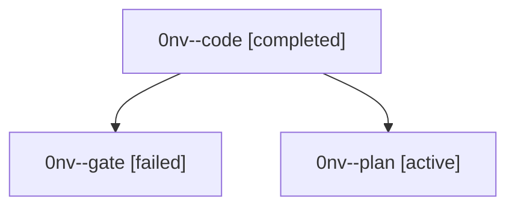

# Family: 0nv

[Agent Hoods](../README.md) / [bbugyi200](../users/bbugyi200/README.md) / [athena](../users/bbugyi200/machines/athena/README.md) / [0nv](../users/bbugyi200/machines/athena/hoods/0nv/README.md) / 0nv

Owner: `bbugyi200.athena` · Hood: `0nv` · Members: 3

## Lineage

The diagram is an optional enhancement; the ordered table below contains the same lineage in accessible text.

| Role | Agent | State | Model / provider | Timing | Commits | Prompt | Chat |
|---|---|---|---|---|---:|---|---|
| code | 0nv--code | completed | sonnet / claude | 2026-09-20T11:25:26.139742+00:00 → 2026-09-20T12:14:24.651856+00:00 | [1](../agents/bbugyi200.athena.0nv--code/README.md#commits) | [Prompt](../agents/bbugyi200.athena.0nv--code/prompt.md) | [Chat](../agents/bbugyi200.athena.0nv--code/chat.md) |
| gate | 0nv--gate | failed | opus / claude | 2026-09-20T11:24:14.517276+00:00 → 2026-09-20T11:25:06.155948+00:00 | 0 | — | [Chat](../agents/bbugyi200.athena.0nv--gate/chat.md) |
| plan | 0nv--plan | active | opus / claude | 2026-09-20T11:07:42.547499+00:00 | 0 | [Prompt](../agents/bbugyi200.athena.0nv--plan/prompt.md) | [Chat](../agents/bbugyi200.athena.0nv--plan/chat.md) |

## Commits

| Role | Repo | Commit | Subject | Committed |
|---|---|---|---|---|
| code | sase | [`bbca06d`](https://github.com/sase-org/sase/commit/bbca06d9efcd943057db4ce31ba65f353832fae1) | fix(service): capture the SSH agent in the service host environment | 2026-09-20 08:10:41 EDT |

## Neighbors

| Agent | Relation | State |
|---|---|---|
| [0nv.f0](bbugyi200.athena.0nv.f0.md) (family · 3) | descendant | active 1, completed 1, failed 1 |
