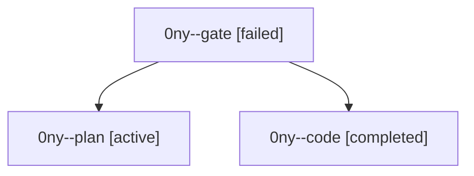

# Family: 0ny

[Agent Hoods](../README.md) / [bbugyi200](../users/bbugyi200/README.md) / [athena](../users/bbugyi200/machines/athena/README.md) / [0ny](../users/bbugyi200/machines/athena/hoods/0ny/README.md) / 0ny

Owner: `bbugyi200.athena` · Hood: `0ny` · Members: 3

## Lineage

The diagram is an optional enhancement; the ordered table below contains the same lineage in accessible text.

| Role | Agent | State | Model / provider | Timing | Commits | Prompt | Chat |
|---|---|---|---|---|---:|---|---|
| gate | 0ny--gate | failed | opus / claude | 2026-09-20T12:30:43.892472+00:00 → 2026-09-20T12:31:27.171165+00:00 | 0 | — | [Chat](../agents/bbugyi200.athena.0ny--gate/chat.md) |
| plan | 0ny--plan | active | opus / claude | 2026-09-20T12:17:21.353656+00:00 | 0 | [Prompt](../agents/bbugyi200.athena.0ny--plan/prompt.md) | [Chat](../agents/bbugyi200.athena.0ny--plan/chat.md) |
| code | 0ny--code | completed | sonnet / claude | 2026-09-20T12:31:47.065373+00:00 → 2026-09-20T13:38:46.092640+00:00 | [1](../agents/bbugyi200.athena.0ny--code/README.md#commits) | [Prompt](../agents/bbugyi200.athena.0ny--code/prompt.md) | [Chat](../agents/bbugyi200.athena.0ny--code/chat.md) |

## Commits

| Role | Repo | Commit | Subject | Committed |
|---|---|---|---|---|
| code | sase | [`6087c0a`](https://github.com/sase-org/sase/commit/6087c0a8e74ed799fbcaef61c61cb4b6615f3e5b) | fix(service): stop the SSH-agent lease failure flood in the issue mirror | 2026-09-20 09:35:46 EDT |
