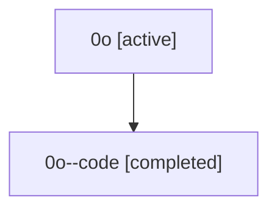

# Family: 0o

[Agent Hoods](../README.md) / [bbugyi200](../users/bbugyi200/README.md) / [athena](../users/bbugyi200/machines/athena/README.md) / [0o](../users/bbugyi200/machines/athena/hoods/0o/README.md) / 0o

Owner: `bbugyi200.athena` · Hood: `0o` · Members: 2

## Lineage

The diagram is an optional enhancement; the ordered table below contains the same lineage in accessible text.

| Role | Agent | State | Model / provider | Timing | Commits | Prompt | Chat |
|---|---|---|---|---|---:|---|---|
| root | 0o | active | claude-fable-5 / claude | 2026-07-07T17:41:47.035208+00:00 | [2](../agents/bbugyi200.athena.0o/README.md#commits) | [Prompt](../agents/bbugyi200.athena.0o/prompt.md) | [Chat](../agents/bbugyi200.athena.0o/chat.md) |
| code | 0o--code | completed | gpt-5.5 / codex | 2026-07-07T17:49:57.729706+00:00 | 0 | — | [Chat](../agents/bbugyi200.athena.0o--code/chat.md) |

## Commits

| Role | Repo | Commit | Subject | Committed (UTC) |
|---|---|---|---|---|
| root | sase | [`68cb9a9`](https://github.com/sase-org/sase/commit/68cb9a919ab5fd45b30f20bea8a13593bc43fa8a) | chore: Add SDD prompt and plan for dev\_update\_editable\_overrides | 2026-07-07 17:49:56 |
| root | sase | [`c91a032`](https://github.com/sase-org/sase/commit/c91a032882aaf7fd6c5bd127e1c2bf98edb23bcd) | fix(uv-tool): write editable overrides for tool reinstalls | 2026-07-07 18:03:48 |
