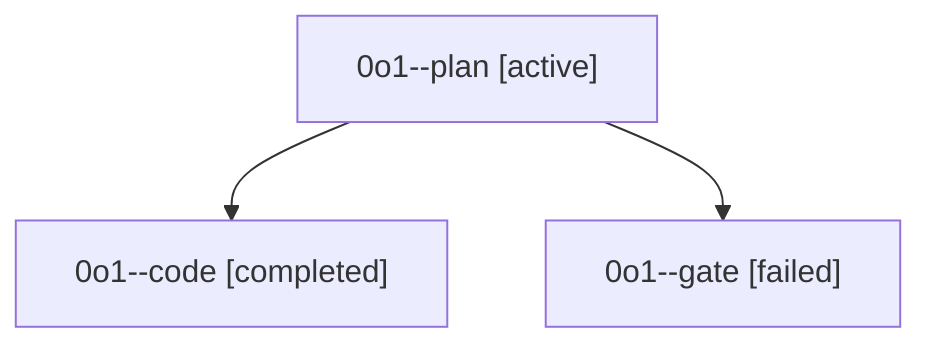

# Family: 0o1

[Agent Hoods](../README.md) / [bbugyi200](../users/bbugyi200/README.md) / [athena](../users/bbugyi200/machines/athena/README.md) / [0o1](../users/bbugyi200/machines/athena/hoods/0o1/README.md) / 0o1

Owner: `bbugyi200.athena` · Hood: `0o1` · Members: 3

## Lineage

The diagram is an optional enhancement; the ordered table below contains the same lineage in accessible text.

| Role | Agent | State | Model / provider | Timing | Commits | Prompt | Chat |
|---|---|---|---|---|---:|---|---|
| plan | 0o1--plan | active | opus / claude | 2026-09-20T14:35:00.663335+00:00 | 0 | [Prompt](../agents/bbugyi200.athena.0o1--plan/prompt.md) | [Chat](../agents/bbugyi200.athena.0o1--plan/chat.md) |
| code | 0o1--code | completed | sonnet / claude | 2026-09-20T14:46:32.627917+00:00 → 2026-09-20T15:41:04.024418+00:00 | [1](../agents/bbugyi200.athena.0o1--code/README.md#commits) | [Prompt](../agents/bbugyi200.athena.0o1--code/prompt.md) | [Chat](../agents/bbugyi200.athena.0o1--code/chat.md) |
| gate | 0o1--gate | failed | opus / claude | 2026-09-20T14:45:18.003576+00:00 → 2026-09-20T14:46:12.235879+00:00 | 0 | — | [Chat](../agents/bbugyi200.athena.0o1--gate/chat.md) |

## Commits

| Role | Repo | Commit | Subject | Committed |
|---|---|---|---|---|
| code | sase | [`598f1e8`](https://github.com/sase-org/sase/commit/598f1e820526b1bf332ed5010b7894e67eb8c90d) | fix(service): resolve plugin console scripts at the service-host spawn seam | 2026-09-20 11:37:57 EDT |
