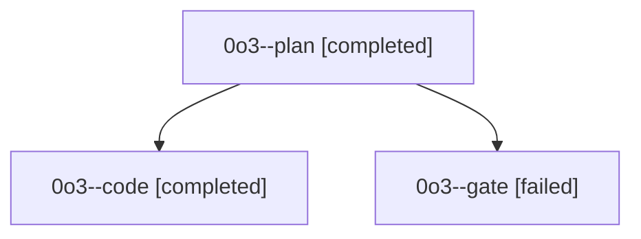

# Family: 0o3

[Agent Hoods](../README.md) / [bbugyi200](../users/bbugyi200/README.md) / [athena](../users/bbugyi200/machines/athena/README.md) / [0o3](../users/bbugyi200/machines/athena/hoods/0o3/README.md) / 0o3

Owner: `bbugyi200.athena` · Hood: `0o3` · Members: 3

## Lineage

The diagram is an optional enhancement; the ordered table below contains the same lineage in accessible text.

| Role | Agent | State | Model / provider | Timing | Commits | Prompt | Chat |
|---|---|---|---|---|---:|---|---|
| plan | 0o3--plan | completed | opus / claude | 2026-09-20T14:36:51.898880+00:00 → 2026-09-20T15:05:25.705020+00:00 | 0 | [Prompt](../agents/bbugyi200.athena.0o3--plan/prompt.md) | [Chat](../agents/bbugyi200.athena.0o3--plan/chat.md) |
| code | 0o3--code | completed | sonnet / claude | 2026-09-20T15:06:42.174695+00:00 → 2026-09-20T16:00:40.311398+00:00 | [1](../agents/bbugyi200.athena.0o3--code/README.md#commits) | [Prompt](../agents/bbugyi200.athena.0o3--code/prompt.md) | [Chat](../agents/bbugyi200.athena.0o3--code/chat.md) |
| gate | 0o3--gate | failed | opus / claude | 2026-09-20T15:03:32.881864+00:00 → 2026-09-20T15:06:12.843409+00:00 | 0 | — | [Chat](../agents/bbugyi200.athena.0o3--gate/chat.md) |

## Commits

| Role | Repo | Commit | Subject | Committed |
|---|---|---|---|---|
| code | sase | [`3078722`](https://github.com/sase-org/sase/commit/307872298758714d7882bbc3f05c91167818e35e) | fix(tui): keep the JUMP footer through footer-only refreshes and cover hint painting | 2026-09-20 11:56:52 EDT |
