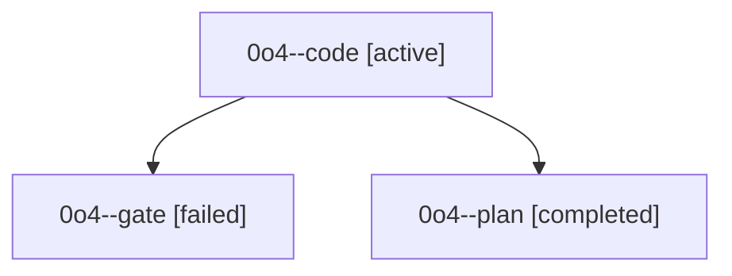

# Family: 0o4

[Agent Hoods](../README.md) / [bbugyi200](../users/bbugyi200/README.md) / [athena](../users/bbugyi200/machines/athena/README.md) / [0o4](../users/bbugyi200/machines/athena/hoods/0o4/README.md) / 0o4

Owner: `bbugyi200.athena` · Hood: `0o4` · Members: 3

## Lineage

The diagram is an optional enhancement; the ordered table below contains the same lineage in accessible text.

| Role | Agent | State | Model / provider | Timing | Commits | Prompt | Chat |
|---|---|---|---|---|---:|---|---|
| code | 0o4--code | active | sonnet / claude | 2026-09-20T16:12:34.371870+00:00 | 0 | [Prompt](../agents/bbugyi200.athena.0o4--code/prompt.md) | — |
| gate | 0o4--gate | failed | opus / claude | 2026-09-20T16:11:04.494442+00:00 → 2026-09-20T16:12:06.951158+00:00 | 0 | — | [Chat](../agents/bbugyi200.athena.0o4--gate/chat.md) |
| plan | 0o4--plan | completed | opus / claude | 2026-09-20T15:57:03.517598+00:00 → 2026-09-20T16:10:58.581750+00:00 | 0 | [Prompt](../agents/bbugyi200.athena.0o4--plan/prompt.md) | [Chat](../agents/bbugyi200.athena.0o4--plan/chat.md) |
