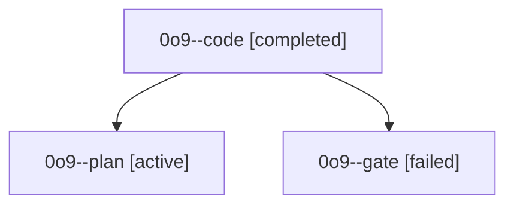

# Family: 0o9

[Agent Hoods](../README.md) / [bbugyi200](../users/bbugyi200/README.md) / [athena](../users/bbugyi200/machines/athena/README.md) / [0o9](../users/bbugyi200/machines/athena/hoods/0o9/README.md) / 0o9

Owner: `bbugyi200.athena` · Hood: `0o9` · Members: 3

## Lineage

The diagram is an optional enhancement; the ordered table below contains the same lineage in accessible text.

| Role | Agent | State | Model / provider | Timing | Commits | Prompt | Chat |
|---|---|---|---|---|---:|---|---|
| code | 0o9--code | completed | sonnet / claude | 2026-09-20T20:06:42.987161+00:00 → 2026-09-20T21:07:15.114796+00:00 | [1](../agents/bbugyi200.athena.0o9--code/README.md#commits) | [Prompt](../agents/bbugyi200.athena.0o9--code/prompt.md) | [Chat](../agents/bbugyi200.athena.0o9--code/chat.md) |
| plan | 0o9--plan | active | opus / claude | 2026-09-20T19:56:12.353435+00:00 | 0 | [Prompt](../agents/bbugyi200.athena.0o9--plan/prompt.md) | [Chat](../agents/bbugyi200.athena.0o9--plan/chat.md) |
| gate | 0o9--gate | failed | opus / claude | 2026-09-20T20:05:12.985141+00:00 → 2026-09-20T20:06:11.502223+00:00 | 0 | — | [Chat](../agents/bbugyi200.athena.0o9--gate/chat.md) |

## Commits

| Role | Repo | Commit | Subject | Committed |
|---|---|---|---|---|
| code | sase | [`8bb6e2e`](https://github.com/sase-org/sase/commit/8bb6e2ec185201cfd2b69f4ce125dbea75ef0361) | fix(tui): keep service-host procs out of the proc gear and restart gate | 2026-09-20 17:06:24 EDT |
