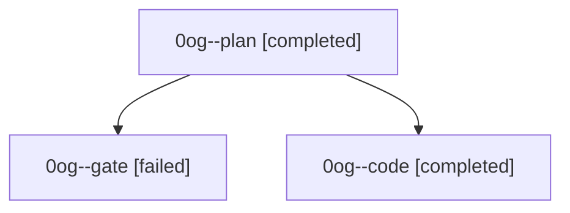

# Family: 0og

[Agent Hoods](../README.md) / [bbugyi200](../users/bbugyi200/README.md) / [athena](../users/bbugyi200/machines/athena/README.md) / [0og](../users/bbugyi200/machines/athena/hoods/0og/README.md) / 0og

Owner: `bbugyi200.athena` · Hood: `0og` · Members: 3

## Lineage

The diagram is an optional enhancement; the ordered table below contains the same lineage in accessible text.

| Role | Agent | State | Model / provider | Timing | Commits | Prompt | Chat |
|---|---|---|---|---|---:|---|---|
| plan | 0og--plan | completed | opus / claude | 2026-09-20T20:40:54.332652+00:00 → 2026-09-20T20:46:20.753375+00:00 | 0 | [Prompt](../agents/bbugyi200.athena.0og--plan/prompt.md) | [Chat](../agents/bbugyi200.athena.0og--plan/chat.md) |
| gate | 0og--gate | failed | opus / claude | 2026-09-20T20:47:46.709307+00:00 → 2026-09-20T20:49:00.414968+00:00 | 0 | — | [Chat](../agents/bbugyi200.athena.0og--gate/chat.md) |
| code | 0og--code | completed | sonnet / claude | 2026-09-20T20:49:28.824218+00:00 → 2026-09-20T21:03:13.782777+00:00 | [1](../agents/bbugyi200.athena.0og--code/README.md#commits) | [Prompt](../agents/bbugyi200.athena.0og--code/prompt.md) | [Chat](../agents/bbugyi200.athena.0og--code/chat.md) |

## Commits

| Role | Repo | Commit | Subject | Committed |
|---|---|---|---|---|
| code | sase | [`4255afb`](https://github.com/sase-org/sase/commit/4255afbb0520516c7eef4725e67979ed8fb0dc3e) | fix(usage): count built-in size-alias pools as provider references | 2026-09-20 16:58:23 EDT |
