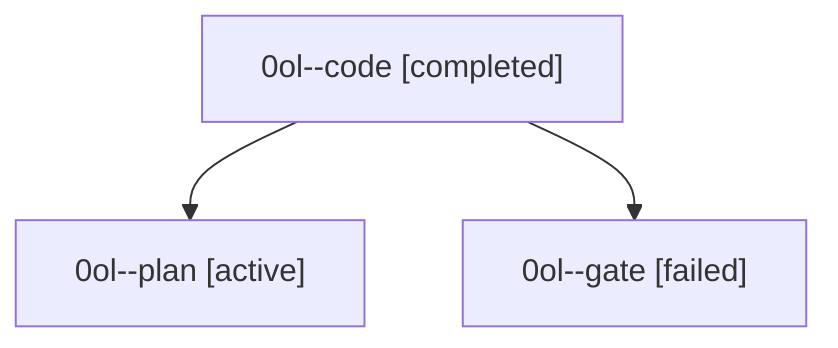

# Family: 0ol

[Agent Hoods](../README.md) / [bbugyi200](../users/bbugyi200/README.md) / [athena](../users/bbugyi200/machines/athena/README.md) / [0ol](../users/bbugyi200/machines/athena/hoods/0ol/README.md) / 0ol

Owner: `bbugyi200.athena` · Hood: `0ol` · Members: 3

## Lineage

The diagram is an optional enhancement; the ordered table below contains the same lineage in accessible text.

| Role | Agent | State | Model / provider | Timing | Commits | Prompt | Chat |
|---|---|---|---|---|---:|---|---|
| code | 0ol--code | completed | muse-spark-1.3-contributor / muse | 2026-09-21T13:27:07.728978+00:00 → 2026-09-21T14:03:57.923961+00:00 | [1](../agents/bbugyi200.athena.0ol--code/README.md#commits) | — | [Chat](../agents/bbugyi200.athena.0ol--code/chat.md) |
| plan | 0ol--plan | active | opus / claude | 2026-09-21T13:19:39.770863+00:00 | 0 | [Prompt](../agents/bbugyi200.athena.0ol--plan/prompt.md) | [Chat](../agents/bbugyi200.athena.0ol--plan/chat.md) |
| gate | 0ol--gate | failed | opus / claude | 2026-09-21T13:24:12.686617+00:00 → 2026-09-21T13:25:20.082290+00:00 | 0 | — | [Chat](../agents/bbugyi200.athena.0ol--gate/chat.md) |

## Commits

| Role | Repo | Commit | Subject | Committed |
|---|---|---|---|---|
| code | sase | [`f330e2b`](https://github.com/sase-org/sase/commit/f330e2b949b5e9744213dd48d7c785cab29b3de1) | feat(preview): content-aware sizing for the prompt preview panel | 2026-09-21 10:00:37 EDT |
