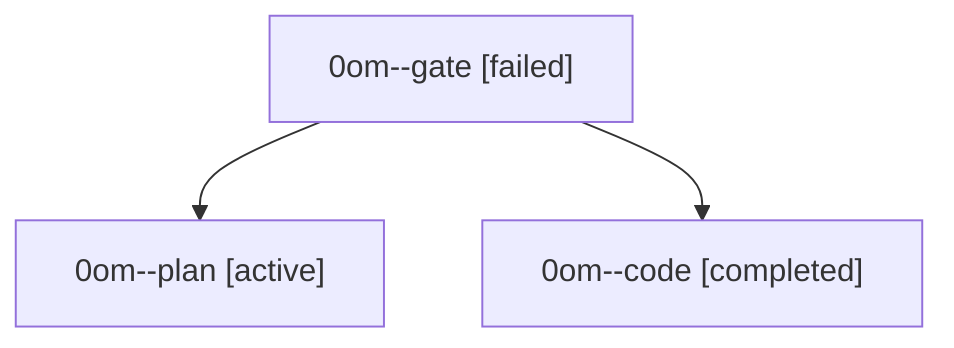

# Family: 0om

[Agent Hoods](../README.md) / [bbugyi200](../users/bbugyi200/README.md) / [athena](../users/bbugyi200/machines/athena/README.md) / [0om](../users/bbugyi200/machines/athena/hoods/0om/README.md) / 0om

Owner: `bbugyi200.athena` · Hood: `0om` · Members: 3

## Lineage

The diagram is an optional enhancement; the ordered table below contains the same lineage in accessible text.

| Role | Agent | State | Model / provider | Timing | Commits | Prompt | Chat |
|---|---|---|---|---|---:|---|---|
| gate | 0om--gate | failed | opus / claude | 2026-09-21T13:52:38.605834+00:00 → 2026-09-21T13:54:27.263463+00:00 | 0 | — | [Chat](../agents/bbugyi200.athena.0om--gate/chat.md) |
| plan | 0om--plan | active | opus / claude | 2026-09-21T13:47:54.525503+00:00 | 0 | [Prompt](../agents/bbugyi200.athena.0om--plan/prompt.md) | [Chat](../agents/bbugyi200.athena.0om--plan/chat.md) |
| code | 0om--code | completed | muse-spark-1.3-contributor / muse | 2026-09-21T13:55:18.537594+00:00 → 2026-09-21T14:15:42.774079+00:00 | [1](../agents/bbugyi200.athena.0om--code/README.md#commits) | [Prompt](../agents/bbugyi200.athena.0om--code/prompt.md) | [Chat](../agents/bbugyi200.athena.0om--code/chat.md) |

## Commits

| Role | Repo | Commit | Subject | Committed |
|---|---|---|---|---|
| code | sase | [`95cb3ab`](https://github.com/sase-org/sase/commit/95cb3ab06714a20d738e07fcb3446ddf1442b088) | feat(tui): show aggregate ?N unknown-wait indicator on clan rows | 2026-09-21 10:12:08 EDT |
