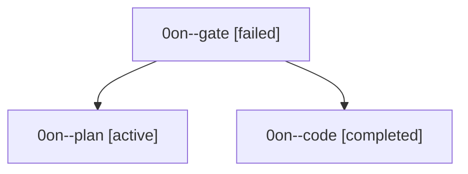

# Family: 0on

[Agent Hoods](../README.md) / [bbugyi200](../users/bbugyi200/README.md) / [athena](../users/bbugyi200/machines/athena/README.md) / [0on](../users/bbugyi200/machines/athena/hoods/0on/README.md) / 0on

Owner: `bbugyi200.athena` · Hood: `0on` · Members: 3

## Lineage

The diagram is an optional enhancement; the ordered table below contains the same lineage in accessible text.

| Role | Agent | State | Model / provider | Timing | Commits | Prompt | Chat |
|---|---|---|---|---|---:|---|---|
| gate | 0on--gate | failed | opus / claude | 2026-09-21T15:20:21.289129+00:00 → 2026-09-21T15:21:58.729202+00:00 | 0 | — | [Chat](../agents/bbugyi200.athena.0on--gate/chat.md) |
| plan | 0on--plan | active | opus / claude | 2026-09-21T15:04:21.217331+00:00 | 0 | [Prompt](../agents/bbugyi200.athena.0on--plan/prompt.md) | [Chat](../agents/bbugyi200.athena.0on--plan/chat.md) |
| code | 0on--code | completed | muse-spark-1.3-contributor / muse | 2026-09-21T15:22:50.915590+00:00 → 2026-09-21T17:08:16.077124+00:00 | [1](../agents/bbugyi200.athena.0on--code/README.md#commits) | [Prompt](../agents/bbugyi200.athena.0on--code/prompt.md) | [Chat](../agents/bbugyi200.athena.0on--code/chat.md) |

## Commits

| Role | Repo | Commit | Subject | Committed |
|---|---|---|---|---|
| code | sase | [`0b30610`](https://github.com/sase-org/sase/commit/0b30610471a5f205b8bf7c951bf78236a7cec193) | feat(beads): add audited sase bead read with visible read reasons | 2026-09-21 13:03:25 EDT |
