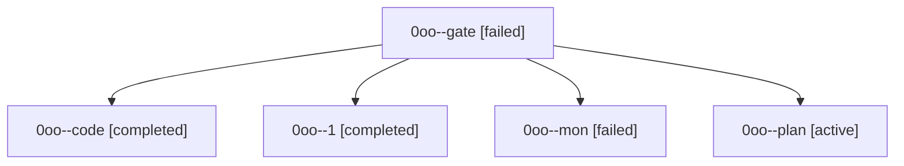

# Family: 0oo

[Agent Hoods](../README.md) / [bbugyi200](../users/bbugyi200/README.md) / [athena](../users/bbugyi200/machines/athena/README.md) / [0oo](../users/bbugyi200/machines/athena/hoods/0oo/README.md) / 0oo

Owner: `bbugyi200.athena` · Hood: `0oo` · Members: 5

## Lineage

The diagram is an optional enhancement; the ordered table below contains the same lineage in accessible text.

| Role | Agent | State | Model / provider | Timing | Commits | Prompt | Chat |
|---|---|---|---|---|---:|---|---|
| gate | 0oo--gate | failed | opus / claude | 2026-09-21T17:55:22.996215+00:00 → 2026-09-21T17:57:27.365506+00:00 | 0 | — | [Chat](../agents/bbugyi200.athena.0oo--gate/chat.md) |
| code | 0oo--code | completed | muse-spark-1.3-contributor / muse | 2026-09-21T17:58:09.851484+00:00 → 2026-09-21T18:14:20.830895+00:00 | 0 | [Prompt](../agents/bbugyi200.athena.0oo--code/prompt.md) | [Chat](../agents/bbugyi200.athena.0oo--code/chat.md) |
| 1 | 0oo--1 | completed | muse-spark-1.3-contributor / muse | 2026-09-21T18:19:34.886044+00:00 → 2026-09-21T19:03:23.639478+00:00 | [1](../agents/bbugyi200.athena.0oo--1/README.md#commits) | [Prompt](../agents/bbugyi200.athena.0oo--1/prompt.md) | [Chat](../agents/bbugyi200.athena.0oo--1/chat.md) |
| mon | 0oo--mon | failed | muse-spark-1.3-contributor / muse | 2026-09-21T18:13:59.501254+00:00 → 2026-09-21T18:19:18.891648+00:00 | 0 | — | [Chat](../agents/bbugyi200.athena.0oo--mon/chat.md) |
| plan | 0oo--plan | active | opus / claude | 2026-09-21T17:16:39.495166+00:00 | 0 | [Prompt](../agents/bbugyi200.athena.0oo--plan/prompt.md) | [Chat](../agents/bbugyi200.athena.0oo--plan/chat.md) |

## Commits

| Role | Repo | Commit | Subject | Committed |
|---|---|---|---|---|
| 1 | sase | [`562d52d`](https://github.com/sase-org/sase/commit/562d52db043d678e6b53e24609b46659d016d4e7) | fix(service): refuse detached service host spawns under pytest | 2026-09-21 15:00:23 EDT |

## Neighbors

| Agent | Relation | State |
|---|---|---|
| [0oo.f0](../agents/bbugyi200.athena.0oo.f0/README.md) | descendant | active |
| [0oo.f0.f0](../agents/bbugyi200.athena.0oo.f0.f0/README.md) | descendant | active |
