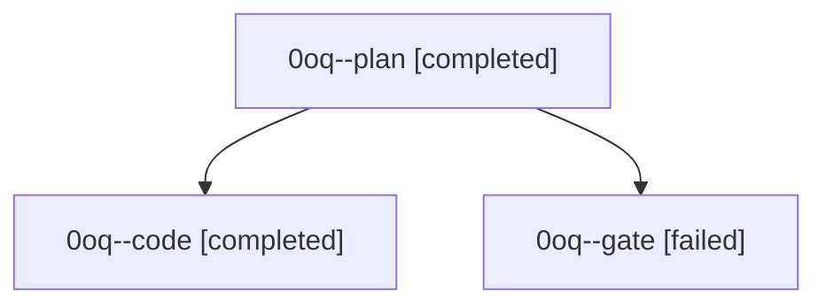

# Family: 0oq

[Agent Hoods](../README.md) / [bbugyi200](../users/bbugyi200/README.md) / [athena](../users/bbugyi200/machines/athena/README.md) / [0oq](../users/bbugyi200/machines/athena/hoods/0oq/README.md) / 0oq

Owner: `bbugyi200.athena` · Hood: `0oq` · Members: 3

## Lineage

The diagram is an optional enhancement; the ordered table below contains the same lineage in accessible text.

| Role | Agent | State | Model / provider | Timing | Commits | Prompt | Chat |
|---|---|---|---|---|---:|---|---|
| plan | 0oq--plan | completed | opus / claude | 2026-09-21T18:15:53.629215+00:00 → 2026-09-21T18:21:19.101271+00:00 | 0 | [Prompt](../agents/bbugyi200.athena.0oq--plan/prompt.md) | [Chat](../agents/bbugyi200.athena.0oq--plan/chat.md) |
| code | 0oq--code | completed | muse-spark-1.3-contributor / muse | 2026-09-21T18:22:59.384171+00:00 → 2026-09-21T19:23:37.156362+00:00 | [1](../agents/bbugyi200.athena.0oq--code/README.md#commits) | [Prompt](../agents/bbugyi200.athena.0oq--code/prompt.md) | [Chat](../agents/bbugyi200.athena.0oq--code/chat.md) |
| gate | 0oq--gate | failed | opus / claude | 2026-09-21T18:21:26.899622+00:00 → 2026-09-21T18:22:21.510841+00:00 | 0 | — | [Chat](../agents/bbugyi200.athena.0oq--gate/chat.md) |

## Commits

| Role | Repo | Commit | Subject | Committed |
|---|---|---|---|---|
| code | sase | [`04d3584`](https://github.com/sase-org/sase/commit/04d35849d1b4d957af7c01ea07a0a0f4a91ed5ff) | feat(ace): agents-tab panel focus follows the selection on refresh | 2026-09-21 15:20:51 EDT |
