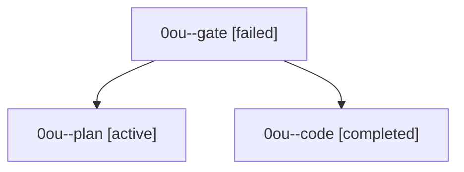

# Family: 0ou

[Agent Hoods](../README.md) / [bbugyi200](../users/bbugyi200/README.md) / [athena](../users/bbugyi200/machines/athena/README.md) / [0ou](../users/bbugyi200/machines/athena/hoods/0ou/README.md) / 0ou

Owner: `bbugyi200.athena` · Hood: `0ou` · Members: 3

## Lineage

The diagram is an optional enhancement; the ordered table below contains the same lineage in accessible text.

| Role | Agent | State | Model / provider | Timing | Commits | Prompt | Chat |
|---|---|---|---|---|---:|---|---|
| gate | 0ou--gate | failed | opus / claude | 2026-09-21T20:44:47.105616+00:00 → 2026-09-21T20:45:10.813212+00:00 | 0 | — | [Chat](../agents/bbugyi200.athena.0ou--gate/chat.md) |
| plan | 0ou--plan | active | opus / claude | 2026-09-21T20:42:41.300542+00:00 | 0 | [Prompt](../agents/bbugyi200.athena.0ou--plan/prompt.md) | [Chat](../agents/bbugyi200.athena.0ou--plan/chat.md) |
| code | 0ou--code | completed | muse-spark-1.3-contributor / muse | 2026-09-21T20:45:27.480863+00:00 → 2026-09-21T22:10:31.052366+00:00 | [1](../agents/bbugyi200.athena.0ou--code/README.md#commits) | — | [Chat](../agents/bbugyi200.athena.0ou--code/chat.md) |

## Commits

| Role | Repo | Commit | Subject | Committed |
|---|---|---|---|---|
| code | sase | [`21c7d00`](https://github.com/sase-org/sase/commit/21c7d0033f7cd30678d0c8f64937f5b9796d92e0) | feat(providers): render Grok/xAI badge as rocket instead of satellite | 2026-09-21 18:06:34 EDT |
