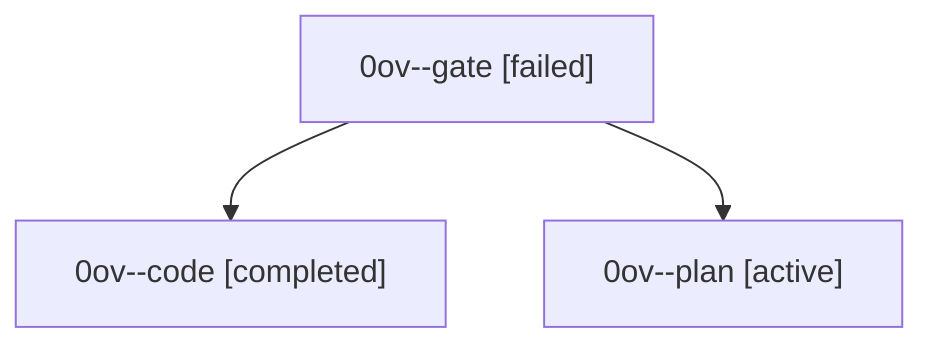

# Family: 0ov

[Agent Hoods](../README.md) / [bbugyi200](../users/bbugyi200/README.md) / [athena](../users/bbugyi200/machines/athena/README.md) / [0ov](../users/bbugyi200/machines/athena/hoods/0ov/README.md) / 0ov

Owner: `bbugyi200.athena` · Hood: `0ov` · Members: 3

## Lineage

The diagram is an optional enhancement; the ordered table below contains the same lineage in accessible text.

| Role | Agent | State | Model / provider | Timing | Commits | Prompt | Chat |
|---|---|---|---|---|---:|---|---|
| gate | 0ov--gate | failed | opus / claude | 2026-09-21T21:08:50.551587+00:00 → 2026-09-21T21:09:54.099369+00:00 | 0 | — | [Chat](../agents/bbugyi200.athena.0ov--gate/chat.md) |
| code | 0ov--code | completed | muse-spark-1.3-contributor / muse | 2026-09-21T21:12:26.354524+00:00 → 2026-09-21T22:15:30.989906+00:00 | [1](../agents/bbugyi200.athena.0ov--code/README.md#commits) | [Prompt](../agents/bbugyi200.athena.0ov--code/prompt.md) | [Chat](../agents/bbugyi200.athena.0ov--code/chat.md) |
| plan | 0ov--plan | active | opus / claude | 2026-09-21T20:54:35.155528+00:00 | 0 | [Prompt](../agents/bbugyi200.athena.0ov--plan/prompt.md) | [Chat](../agents/bbugyi200.athena.0ov--plan/chat.md) |

## Commits

| Role | Repo | Commit | Subject | Committed |
|---|---|---|---|---|
| code | sase | [`651a32e`](https://github.com/sase-org/sase/commit/651a32ee00fb2302b34c8de11c1aeda1a98649c6) | feat(ace): Agents-tab A toggles bare %auto instead of opening the Auto-Approve menu | 2026-09-21 18:13:46 EDT |
