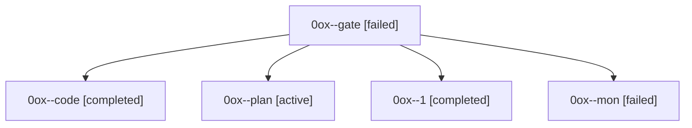

# Family: 0ox

[Agent Hoods](../README.md) / [bbugyi200](../users/bbugyi200/README.md) / [athena](../users/bbugyi200/machines/athena/README.md) / [0ox](../users/bbugyi200/machines/athena/hoods/0ox/README.md) / 0ox

Owner: `bbugyi200.athena` · Hood: `0ox` · Members: 5

## Lineage

The diagram is an optional enhancement; the ordered table below contains the same lineage in accessible text.

| Role | Agent | State | Model / provider | Timing | Commits | Prompt | Chat |
|---|---|---|---|---|---:|---|---|
| gate | 0ox--gate | failed | opus / claude | 2026-09-21T22:29:47.343958+00:00 → 2026-09-21T22:31:22.724723+00:00 | 0 | — | [Chat](../agents/bbugyi200.athena.0ox--gate/chat.md) |
| code | 0ox--code | completed | muse-spark-1.3-contributor / muse | 2026-09-21T22:32:01.302922+00:00 → 2026-09-21T23:00:02.244233+00:00 | 0 | [Prompt](../agents/bbugyi200.athena.0ox--code/prompt.md) | [Chat](../agents/bbugyi200.athena.0ox--code/chat.md) |
| plan | 0ox--plan | active | opus / claude | 2026-09-21T22:16:27.204143+00:00 | 0 | [Prompt](../agents/bbugyi200.athena.0ox--plan/prompt.md) | [Chat](../agents/bbugyi200.athena.0ox--plan/chat.md) |
| 1 | 0ox--1 | completed | muse-spark-1.3-contributor / muse | 2026-09-21T23:09:23.343581+00:00 → 2026-09-21T23:17:37.548692+00:00 | [1](../agents/bbugyi200.athena.0ox--1/README.md#commits) | [Prompt](../agents/bbugyi200.athena.0ox--1/prompt.md) | [Chat](../agents/bbugyi200.athena.0ox--1/chat.md) |
| mon | 0ox--mon | failed | muse-spark-1.3-contributor / muse | 2026-09-21T22:55:37.895362+00:00 → 2026-09-21T23:09:10.149944+00:00 | 0 | — | [Chat](../agents/bbugyi200.athena.0ox--mon/chat.md) |

## Commits

| Role | Repo | Commit | Subject | Committed |
|---|---|---|---|---|
| 1 | sase | [`1567269`](https://github.com/sase-org/sase/commit/1567269ca737c9949f0692c54a78cc48cb461d93) | feat(axe): preserve launch handoffs across post-wait runner refresh | 2026-09-21 19:16:44 EDT |
