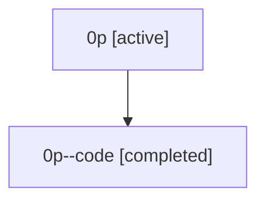

# Family: 0p

Owner: `bbugyi200.athena` · Hood: `0p` · Members: 2

## Lineage

The diagram is an optional enhancement; the ordered table below contains the same lineage in accessible text.

| Role | Agent | State | Model / provider | Timing | Commits | Prompt | Chat |
|---|---|---|---|---|---:|---|---|
| root | 0p | active | claude-fable-5 / claude | 2026-07-07T17:54:54.437504+00:00 | 4 | [Prompt](../agents/bbugyi200.athena.0p/prompt.md) | [Chat](../agents/bbugyi200.athena.0p/chat.md) |
| code | 0p--code | completed | gpt-5.5 / codex | 2026-07-07T18:06:48.577621+00:00 | 1 | — | [Chat](../agents/bbugyi200.athena.0p--code/chat.md) |
