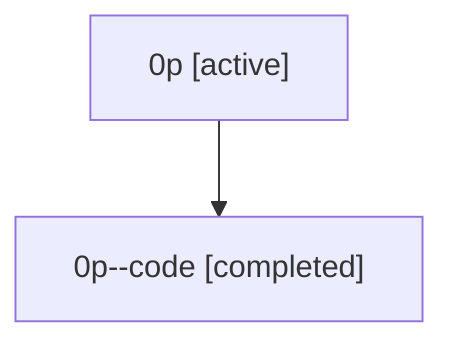

# Family: 0p

[Agent Hoods](../README.md) / [bbugyi200](../users/bbugyi200/README.md) / [athena](../users/bbugyi200/machines/athena/README.md) / [0p](../users/bbugyi200/machines/athena/hoods/0p/README.md) / 0p

Owner: `bbugyi200.athena` · Hood: `0p` · Members: 2

## Lineage

The diagram is an optional enhancement; the ordered table below contains the same lineage in accessible text.

| Role | Agent | State | Model / provider | Timing | Commits | Prompt | Chat |
|---|---|---|---|---|---:|---|---|
| root | 0p | active | claude-fable-5 / claude | 2026-07-07T17:54:54.437504+00:00 | [4](../agents/bbugyi200.athena.0p/README.md#commits) | [Prompt](../agents/bbugyi200.athena.0p/prompt.md) | [Chat](../agents/bbugyi200.athena.0p/chat.md) |
| code | 0p--code | completed | gpt-5.5 / codex | 2026-07-07T18:06:48.577621+00:00 | [1](../agents/bbugyi200.athena.0p--code/README.md#commits) | — | [Chat](../agents/bbugyi200.athena.0p--code/chat.md) |

## Commits

| Role | Commit | Subject | Committed (UTC) |
|---|---|---|---|
| root | [`2cc38ed`](https://github.com/sase-org/sase/commit/2cc38ed789d16a7279f9925a3b1137189b89d957) | chore: Add SDD prompt and plan for output\_var\_digit\_namespaces | 2026-06-03 03:12:48 |
| root | [`49dcdcb`](https://github.com/sase-org/sase/commit/49dcdcb4a95d64d82e481fe9e611fa8d54c76ec2) | fix: normalize digit-leading output variable namespaces | 2026-06-03 03:21:26 |
| root | [`987b2dd`](https://github.com/sase-org/sase/commit/987b2dd4c63019f835501163cd6c52618ace5800) | chore: Add SDD prompt and plan for xprompt\_lsp\_update\_reconcile | 2026-07-07 18:06:47 |
| code | [`af1ff13`](https://github.com/sase-org/sase/commit/af1ff138ccb8d12add5eecb908cd2c0411b84a22) | feat: manage xprompt LSP installs during dev updates | 2026-07-07 18:21:44 |
| root | [`af1ff13`](https://github.com/sase-org/sase/commit/af1ff138ccb8d12add5eecb908cd2c0411b84a22) | feat: manage xprompt LSP installs during dev updates | 2026-07-07 18:21:44 |
