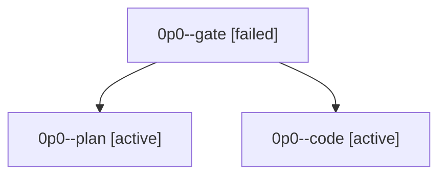

# Family: 0p0

[Agent Hoods](../README.md) / [bbugyi200](../users/bbugyi200/README.md) / [athena](../users/bbugyi200/machines/athena/README.md) / [0p0](../users/bbugyi200/machines/athena/hoods/0p0/README.md) / 0p0

Owner: `bbugyi200.athena` · Hood: `0p0` · Members: 3

## Lineage

The diagram is an optional enhancement; the ordered table below contains the same lineage in accessible text.

| Role | Agent | State | Model / provider | Timing | Commits | Prompt | Chat |
|---|---|---|---|---|---:|---|---|
| gate | 0p0--gate | failed | opus / claude | 2026-09-22T10:50:48.603662+00:00 → 2026-09-22T10:51:05.469870+00:00 | 0 | — | [Chat](../agents/bbugyi200.athena.0p0--gate/chat.md) |
| plan | 0p0--plan | active | opus / claude | 2026-09-22T10:48:04.410973+00:00 | 0 | [Prompt](../agents/bbugyi200.athena.0p0--plan/prompt.md) | [Chat](../agents/bbugyi200.athena.0p0--plan/chat.md) |
| code | 0p0--code | active | muse-spark-1.3-contributor / muse | 2026-09-22T10:51:22.977892+00:00 | 0 | — | — |
