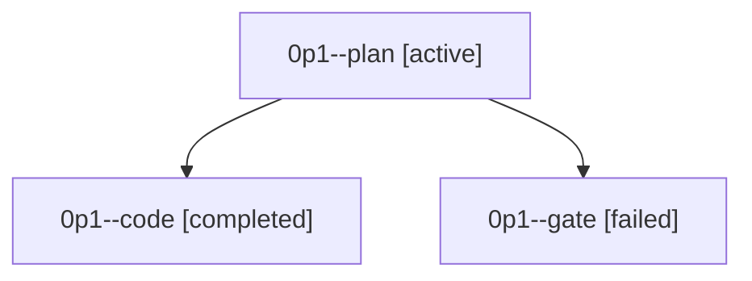

# Family: 0p1

[Agent Hoods](../README.md) / [bbugyi200](../users/bbugyi200/README.md) / [athena](../users/bbugyi200/machines/athena/README.md) / [0p1](../users/bbugyi200/machines/athena/hoods/0p1/README.md) / 0p1

Owner: `bbugyi200.athena` · Hood: `0p1` · Members: 3

## Lineage

The diagram is an optional enhancement; the ordered table below contains the same lineage in accessible text.

| Role | Agent | State | Model / provider | Timing | Commits | Prompt | Chat |
|---|---|---|---|---|---:|---|---|
| plan | 0p1--plan | active | opus / claude | 2026-09-22T10:57:30.100864+00:00 | 0 | [Prompt](../agents/bbugyi200.athena.0p1--plan/prompt.md) | [Chat](../agents/bbugyi200.athena.0p1--plan/chat.md) |
| code | 0p1--code | completed | muse-spark-1.3-contributor / muse | 2026-09-22T11:02:25.198268+00:00 → 2026-09-22T11:29:39.630488+00:00 | [1](../agents/bbugyi200.athena.0p1--code/README.md#commits) | [Prompt](../agents/bbugyi200.athena.0p1--code/prompt.md) | [Chat](../agents/bbugyi200.athena.0p1--code/chat.md) |
| gate | 0p1--gate | failed | opus / claude | 2026-09-22T11:01:18.082443+00:00 → 2026-09-22T11:02:06.423025+00:00 | 0 | — | [Chat](../agents/bbugyi200.athena.0p1--gate/chat.md) |

## Commits

| Role | Repo | Commit | Subject | Committed |
|---|---|---|---|---|
| code | sase | [`fc64284`](https://github.com/sase-org/sase/commit/fc642845c942bf52dc99595b4e844cedbeacb767) | fix(artifacts-query): match path filters by substring on Plans and provider panes | 2026-09-22 07:26:48 EDT |
