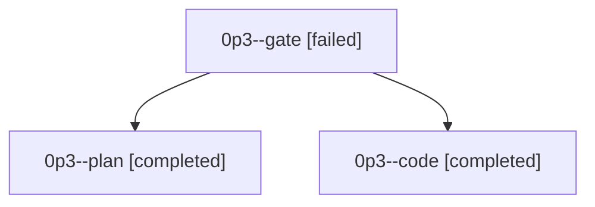

# Family: 0p3

[Agent Hoods](../README.md) / [bbugyi200](../users/bbugyi200/README.md) / [athena](../users/bbugyi200/machines/athena/README.md) / [0p3](../users/bbugyi200/machines/athena/hoods/0p3/README.md) / 0p3

Owner: `bbugyi200.athena` · Hood: `0p3` · Members: 3

## Lineage

The diagram is an optional enhancement; the ordered table below contains the same lineage in accessible text.

| Role | Agent | State | Model / provider | Timing | Commits | Prompt | Chat |
|---|---|---|---|---|---:|---|---|
| gate | 0p3--gate | failed | opus / claude | 2026-09-22T11:57:42.571560+00:00 → 2026-09-22T11:58:26.728532+00:00 | 0 | — | [Chat](../agents/bbugyi200.athena.0p3--gate/chat.md) |
| plan | 0p3--plan | completed | opus / claude | 2026-09-22T11:44:38.177650+00:00 → 2026-09-22T11:57:32.423346+00:00 | 0 | [Prompt](../agents/bbugyi200.athena.0p3--plan/prompt.md) | [Chat](../agents/bbugyi200.athena.0p3--plan/chat.md) |
| code | 0p3--code | completed | muse-spark-1.3-contributor / muse | 2026-09-22T11:58:45.230026+00:00 → 2026-09-22T12:25:46.053272+00:00 | [1](../agents/bbugyi200.athena.0p3--code/README.md#commits) | [Prompt](../agents/bbugyi200.athena.0p3--code/prompt.md) | [Chat](../agents/bbugyi200.athena.0p3--code/chat.md) |

## Commits

| Role | Repo | Commit | Subject | Committed |
|---|---|---|---|---|
| code | sase | [`ba71aa5`](https://github.com/sase-org/sase/commit/ba71aa524f81f2541c40e4d2994f7ea10f876141) | fix(service): reboot-proof service-host GitHub credential and login-session warnings | 2026-09-22 08:23:08 EDT |
