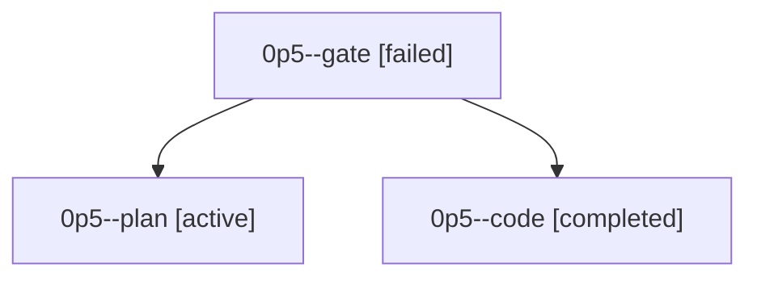

# Family: 0p5

[Agent Hoods](../README.md) / [bbugyi200](../users/bbugyi200/README.md) / [athena](../users/bbugyi200/machines/athena/README.md) / [0p5](../users/bbugyi200/machines/athena/hoods/0p5/README.md) / 0p5

Owner: `bbugyi200.athena` · Hood: `0p5` · Members: 3

## Lineage

The diagram is an optional enhancement; the ordered table below contains the same lineage in accessible text.

| Role | Agent | State | Model / provider | Timing | Commits | Prompt | Chat |
|---|---|---|---|---|---:|---|---|
| gate | 0p5--gate | failed | opus / claude | 2026-09-22T12:18:53.251027+00:00 → 2026-09-22T12:19:38.494706+00:00 | 0 | — | [Chat](../agents/bbugyi200.athena.0p5--gate/chat.md) |
| plan | 0p5--plan | active | opus / claude | 2026-09-22T12:07:02.279198+00:00 | 0 | [Prompt](../agents/bbugyi200.athena.0p5--plan/prompt.md) | [Chat](../agents/bbugyi200.athena.0p5--plan/chat.md) |
| code | 0p5--code | completed | muse-spark-1.3-contributor / muse | 2026-09-22T12:19:57.640746+00:00 → 2026-09-22T12:44:30.583668+00:00 | [1](../agents/bbugyi200.athena.0p5--code/README.md#commits) | [Prompt](../agents/bbugyi200.athena.0p5--code/prompt.md) | [Chat](../agents/bbugyi200.athena.0p5--code/chat.md) |

## Commits

| Role | Repo | Commit | Subject | Committed |
|---|---|---|---|---|
| code | sase | [`d6a64c6`](https://github.com/sase-org/sase/commit/d6a64c6b682107714be1844cfdd719487d8d11ca) | feat(bead): refuse agent bead show with read/view/query guard | 2026-09-22 08:38:15 EDT |
