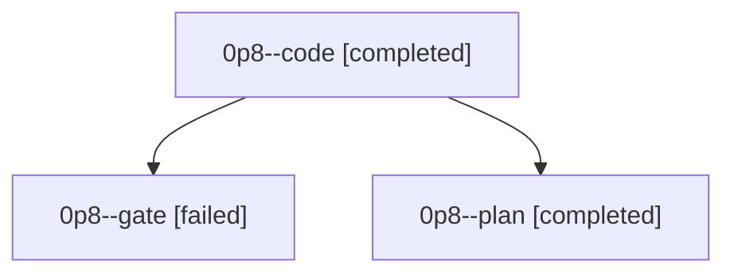

# Family: 0p8

[Agent Hoods](../README.md) / [bbugyi200](../users/bbugyi200/README.md) / [athena](../users/bbugyi200/machines/athena/README.md) / [0p8](../users/bbugyi200/machines/athena/hoods/0p8/README.md) / 0p8

Owner: `bbugyi200.athena` · Hood: `0p8` · Members: 3

## Lineage

The diagram is an optional enhancement; the ordered table below contains the same lineage in accessible text.

| Role | Agent | State | Model / provider | Timing | Commits | Prompt | Chat |
|---|---|---|---|---|---:|---|---|
| code | 0p8--code | completed | muse-spark-1.3-contributor / muse | 2026-09-22T13:51:18.207134+00:00 → 2026-09-22T14:11:24.389959+00:00 | 0 | [Prompt](../agents/bbugyi200.athena.0p8--code/prompt.md) | [Chat](../agents/bbugyi200.athena.0p8--code/chat.md) |
| gate | 0p8--gate | failed | opus / claude | 2026-09-22T13:49:40.671648+00:00 → 2026-09-22T13:50:49.393286+00:00 | 0 | — | [Chat](../agents/bbugyi200.athena.0p8--gate/chat.md) |
| plan | 0p8--plan | completed | opus / claude | 2026-09-22T13:43:32.946179+00:00 → 2026-09-22T13:49:28.916708+00:00 | 0 | [Prompt](../agents/bbugyi200.athena.0p8--plan/prompt.md) | [Chat](../agents/bbugyi200.athena.0p8--plan/chat.md) |
