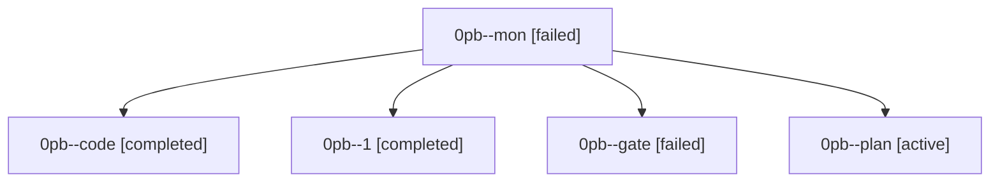

# Family: 0pb

[Agent Hoods](../README.md) / [bbugyi200](../users/bbugyi200/README.md) / [athena](../users/bbugyi200/machines/athena/README.md) / [0pb](../users/bbugyi200/machines/athena/hoods/0pb/README.md) / 0pb

Owner: `bbugyi200.athena` · Hood: `0pb` · Members: 5

## Lineage

The diagram is an optional enhancement; the ordered table below contains the same lineage in accessible text.

| Role | Agent | State | Model / provider | Timing | Commits | Prompt | Chat |
|---|---|---|---|---|---:|---|---|
| mon | 0pb--mon | failed | muse-spark-1.3-contributor / muse | 2026-09-22T14:43:13.030989+00:00 → 2026-09-22T14:47:00.709389+00:00 | 0 | — | [Chat](../agents/bbugyi200.athena.0pb--mon/chat.md) |
| code | 0pb--code | completed | muse-spark-1.3-contributor / muse | 2026-09-22T14:17:21.841956+00:00 → 2026-09-22T14:43:38.309069+00:00 | 0 | — | [Chat](../agents/bbugyi200.athena.0pb--code/chat.md) |
| 1 | 0pb--1 | completed | muse-spark-1.3-contributor / muse | 2026-09-22T14:47:00.309798+00:00 → 2026-09-22T15:50:33.708424+00:00 | [1](../agents/bbugyi200.athena.0pb--1/README.md#commits) | [Prompt](../agents/bbugyi200.athena.0pb--1/prompt.md) | [Chat](../agents/bbugyi200.athena.0pb--1/chat.md) |
| gate | 0pb--gate | failed | opus / claude | 2026-09-22T14:16:45.745758+00:00 → 2026-09-22T14:17:01.635746+00:00 | 0 | — | [Chat](../agents/bbugyi200.athena.0pb--gate/chat.md) |
| plan | 0pb--plan | active | opus / claude | 2026-09-22T14:04:45.583541+00:00 | 0 | [Prompt](../agents/bbugyi200.athena.0pb--plan/prompt.md) | [Chat](../agents/bbugyi200.athena.0pb--plan/chat.md) |

## Commits

| Role | Repo | Commit | Subject | Committed |
|---|---|---|---|---|
| 1 | sase | [`8d1779a`](https://github.com/sase-org/sase/commit/8d1779a3efb34bc33db2373d7f82e9ad94d3be7a) | feat(ace): vim operator + search motions in the prompt input | 2026-09-22 11:45:24 EDT |
