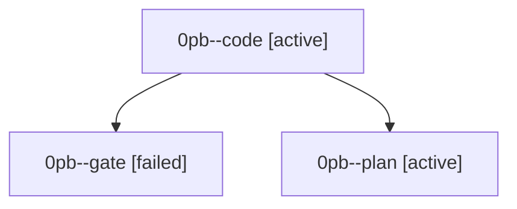

# Family: 0pb

[Agent Hoods](../README.md) / [bbugyi200](../users/bbugyi200/README.md) / [athena](../users/bbugyi200/machines/athena/README.md) / [0pb](../users/bbugyi200/machines/athena/hoods/0pb/README.md) / 0pb

Owner: `bbugyi200.athena` · Hood: `0pb` · Members: 3

## Lineage

The diagram is an optional enhancement; the ordered table below contains the same lineage in accessible text.

| Role | Agent | State | Model / provider | Timing | Commits | Prompt | Chat |
|---|---|---|---|---|---:|---|---|
| code | 0pb--code | active | muse-spark-1.3-contributor / muse | 2026-09-22T14:17:21.841956+00:00 | 0 | — | — |
| gate | 0pb--gate | failed | opus / claude | 2026-09-22T14:16:45.745758+00:00 → 2026-09-22T14:17:01.635746+00:00 | 0 | — | [Chat](../agents/bbugyi200.athena.0pb--gate/chat.md) |
| plan | 0pb--plan | active | opus / claude | 2026-09-22T14:04:45.583541+00:00 | 0 | [Prompt](../agents/bbugyi200.athena.0pb--plan/prompt.md) | [Chat](../agents/bbugyi200.athena.0pb--plan/chat.md) |
