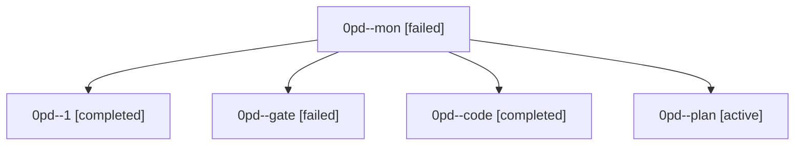

# Family: 0pd

[Agent Hoods](../README.md) / [bbugyi200](../users/bbugyi200/README.md) / [athena](../users/bbugyi200/machines/athena/README.md) / [0pd](../users/bbugyi200/machines/athena/hoods/0pd/README.md) / 0pd

Owner: `bbugyi200.athena` · Hood: `0pd` · Members: 5

## Lineage

The diagram is an optional enhancement; the ordered table below contains the same lineage in accessible text.

| Role | Agent | State | Model / provider | Timing | Commits | Prompt | Chat |
|---|---|---|---|---|---:|---|---|
| mon | 0pd--mon | failed | muse-spark-1.3-contributor / muse | 2026-09-22T17:00:19.587262+00:00 → 2026-09-22T17:05:45.848732+00:00 | 0 | — | [Chat](../agents/bbugyi200.athena.0pd--mon/chat.md) |
| 1 | 0pd--1 | completed | muse-spark-1.3-contributor / muse | 2026-09-22T17:08:15.798002+00:00 → 2026-09-22T17:27:26.686094+00:00 | [1](../agents/bbugyi200.athena.0pd--1/README.md#commits) | [Prompt](../agents/bbugyi200.athena.0pd--1/prompt.md) | [Chat](../agents/bbugyi200.athena.0pd--1/chat.md) |
| gate | 0pd--gate | failed | opus / claude | 2026-09-22T16:30:04.124151+00:00 → 2026-09-22T16:31:08.562881+00:00 | 0 | — | [Chat](../agents/bbugyi200.athena.0pd--gate/chat.md) |
| code | 0pd--code | completed | muse-spark-1.3-contributor / muse | 2026-09-22T16:31:29.822099+00:00 → 2026-09-22T17:00:48.053002+00:00 | 0 | [Prompt](../agents/bbugyi200.athena.0pd--code/prompt.md) | [Chat](../agents/bbugyi200.athena.0pd--code/chat.md) |
| plan | 0pd--plan | active | opus / claude | 2026-09-22T16:18:41.345733+00:00 | 0 | [Prompt](../agents/bbugyi200.athena.0pd--plan/prompt.md) | [Chat](../agents/bbugyi200.athena.0pd--plan/chat.md) |

## Commits

| Role | Repo | Commit | Subject | Committed |
|---|---|---|---|---|
| 1 | sase | [`6f48c0c`](https://github.com/sase-org/sase/commit/6f48c0cc2e4af701db71fdce25f7d8e51082bfc9) | fix(sdd): pull split-beads sidecar clones with layout-aware bead store | 2026-09-22 13:24:43 EDT |
