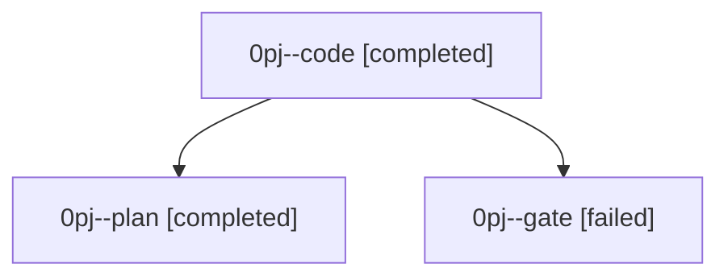

# Family: 0pj

[Agent Hoods](../README.md) / [bbugyi200](../users/bbugyi200/README.md) / [athena](../users/bbugyi200/machines/athena/README.md) / [0pj](../users/bbugyi200/machines/athena/hoods/0pj/README.md) / 0pj

Owner: `bbugyi200.athena` · Hood: `0pj` · Members: 3

## Lineage

The diagram is an optional enhancement; the ordered table below contains the same lineage in accessible text.

| Role | Agent | State | Model / provider | Timing | Commits | Prompt | Chat |
|---|---|---|---|---|---:|---|---|
| code | 0pj--code | completed | muse-spark-1.3-contributor / muse | 2026-09-22T19:50:03.507635+00:00 → 2026-09-22T21:02:16.080594+00:00 | [1](../agents/bbugyi200.athena.0pj--code/README.md#commits) | — | [Chat](../agents/bbugyi200.athena.0pj--code/chat.md) |
| plan | 0pj--plan | completed | opus / claude | 2026-09-22T19:46:50.122482+00:00 → 2026-09-22T21:02:16.080594+00:00 | 0 | [Prompt](../agents/bbugyi200.athena.0pj--plan/prompt.md) | [Chat](../agents/bbugyi200.athena.0pj--plan/chat.md) |
| gate | 0pj--gate | failed | opus / claude | 2026-09-22T19:49:13.582719+00:00 → 2026-09-22T19:49:44.564325+00:00 | 0 | — | [Chat](../agents/bbugyi200.athena.0pj--gate/chat.md) |

## Commits

| Role | Repo | Commit | Subject | Committed |
|---|---|---|---|---|
| code | sase | [`fb7a1d4`](https://github.com/sase-org/sase/commit/fb7a1d4132dd7a74e6155dbe47de0febaf986861) | test(fakey): use renamed research\_swarm image input | 2026-09-22 17:00:36 EDT |
