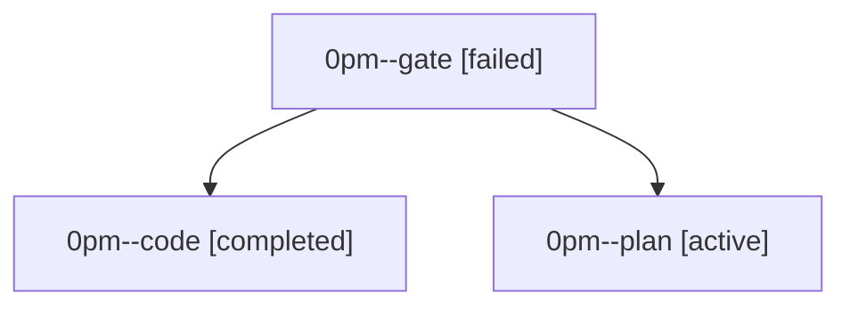

# Family: 0pm

[Agent Hoods](../README.md) / [bbugyi200](../users/bbugyi200/README.md) / [athena](../users/bbugyi200/machines/athena/README.md) / [0pm](../users/bbugyi200/machines/athena/hoods/0pm/README.md) / 0pm

Owner: `bbugyi200.athena` · Hood: `0pm` · Members: 3

## Lineage

The diagram is an optional enhancement; the ordered table below contains the same lineage in accessible text.

| Role | Agent | State | Model / provider | Timing | Commits | Prompt | Chat |
|---|---|---|---|---|---:|---|---|
| gate | 0pm--gate | failed | opus / claude | 2026-09-22T22:26:46.955675+00:00 → 2026-09-22T22:27:43.651062+00:00 | 0 | — | [Chat](../agents/bbugyi200.athena.0pm--gate/chat.md) |
| code | 0pm--code | completed | muse-spark-1.3-contributor / muse | 2026-09-22T22:28:04.340244+00:00 → 2026-09-22T22:55:22.165319+00:00 | [1](../agents/bbugyi200.athena.0pm--code/README.md#commits) | [Prompt](../agents/bbugyi200.athena.0pm--code/prompt.md) | [Chat](../agents/bbugyi200.athena.0pm--code/chat.md) |
| plan | 0pm--plan | active | opus / claude | 2026-09-22T22:21:37.695775+00:00 | 0 | [Prompt](../agents/bbugyi200.athena.0pm--plan/prompt.md) | [Chat](../agents/bbugyi200.athena.0pm--plan/chat.md) |

## Commits

| Role | Repo | Commit | Subject | Committed |
|---|---|---|---|---|
| code | sase | [`4022cfe`](https://github.com/sase-org/sase/commit/4022cfe595330e2af2c497868fbd8ef62b156c48) | fix(agents): resolve workflow children of project-level workflows to parent meta Patch | 2026-09-22 18:51:26 EDT |
