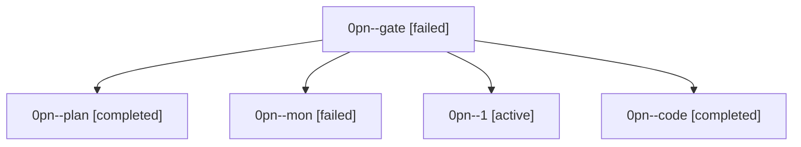

# Family: 0pn

[Agent Hoods](../README.md) / [bbugyi200](../users/bbugyi200/README.md) / [athena](../users/bbugyi200/machines/athena/README.md) / [0pn](../users/bbugyi200/machines/athena/hoods/0pn/README.md) / 0pn

Owner: `bbugyi200.athena` · Hood: `0pn` · Members: 5

## Lineage

The diagram is an optional enhancement; the ordered table below contains the same lineage in accessible text.

| Role | Agent | State | Model / provider | Timing | Commits | Prompt | Chat |
|---|---|---|---|---|---:|---|---|
| gate | 0pn--gate | failed | opus / claude | 2026-09-23T11:00:11.887111+00:00 → 2026-09-23T11:00:54.758784+00:00 | 0 | — | [Chat](../agents/bbugyi200.athena.0pn--gate/chat.md) |
| plan | 0pn--plan | completed | opus / claude | 2026-09-23T03:52:52.316275+00:00 → 2026-09-23T06:10:56.563068+00:00 | 0 | [Prompt](../agents/bbugyi200.athena.0pn--plan/prompt.md) | [Chat](../agents/bbugyi200.athena.0pn--plan/chat.md) |
| mon | 0pn--mon | failed | muse-spark-1.3-contributor / muse | 2026-09-23T11:22:04.401547+00:00 → 2026-09-23T11:42:08.458523+00:00 | 0 | — | [Chat](../agents/bbugyi200.athena.0pn--mon/chat.md) |
| 1 | 0pn--1 | active | muse-spark-1.3-contributor / muse | 2026-09-23T11:42:32.659718+00:00 | [1](../agents/bbugyi200.athena.0pn--1/README.md#commits) | [Prompt](../agents/bbugyi200.athena.0pn--1/prompt.md) | — |
| code | 0pn--code | completed | muse-spark-1.3-contributor / muse | 2026-09-23T11:01:17.983463+00:00 → 2026-09-23T11:22:31.001518+00:00 | 0 | [Prompt](../agents/bbugyi200.athena.0pn--code/prompt.md) | [Chat](../agents/bbugyi200.athena.0pn--code/chat.md) |

## Commits

| Role | Repo | Commit | Subject | Committed |
|---|---|---|---|---|
| 1 | sase | [`c87c9d1`](https://github.com/sase-org/sase/commit/c87c9d1aa9383d0d9bd5431b0339f72270100329) | fix(gate): repair Master Gate failures and shrink docs PDF under size gate | 2026-09-23 07:46:04 EDT |
