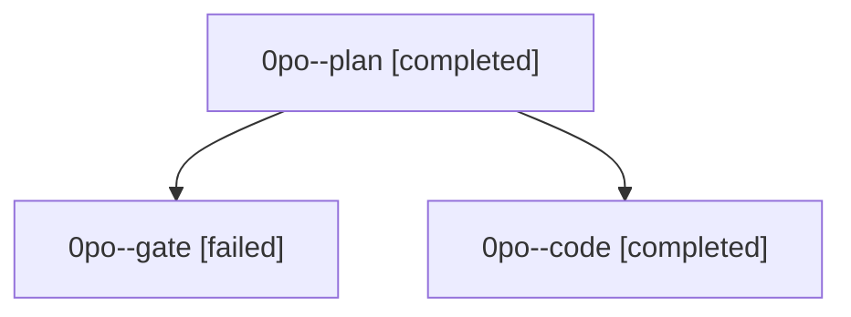

# Family: 0po

[Agent Hoods](../README.md) / [bbugyi200](../users/bbugyi200/README.md) / [athena](../users/bbugyi200/machines/athena/README.md) / [0po](../users/bbugyi200/machines/athena/hoods/0po/README.md) / 0po

Owner: `bbugyi200.athena` · Hood: `0po` · Members: 3

## Lineage

The diagram is an optional enhancement; the ordered table below contains the same lineage in accessible text.

| Role | Agent | State | Model / provider | Timing | Commits | Prompt | Chat |
|---|---|---|---|---|---:|---|---|
| plan | 0po--plan | completed | opus / claude | 2026-09-22T22:32:41.443288+00:00 → 2026-09-22T22:43:14.184949+00:00 | 0 | [Prompt](../agents/bbugyi200.athena.0po--plan/prompt.md) | [Chat](../agents/bbugyi200.athena.0po--plan/chat.md) |
| gate | 0po--gate | failed | opus / claude | 2026-09-22T22:43:30.925198+00:00 → 2026-09-22T22:44:48.517940+00:00 | 0 | — | [Chat](../agents/bbugyi200.athena.0po--gate/chat.md) |
| code | 0po--code | completed | muse-spark-1.3-contributor / muse | 2026-09-22T22:45:31.290162+00:00 → 2026-09-22T22:53:23.022500+00:00 | 0 | [Prompt](../agents/bbugyi200.athena.0po--code/prompt.md) | [Chat](../agents/bbugyi200.athena.0po--code/chat.md) |
