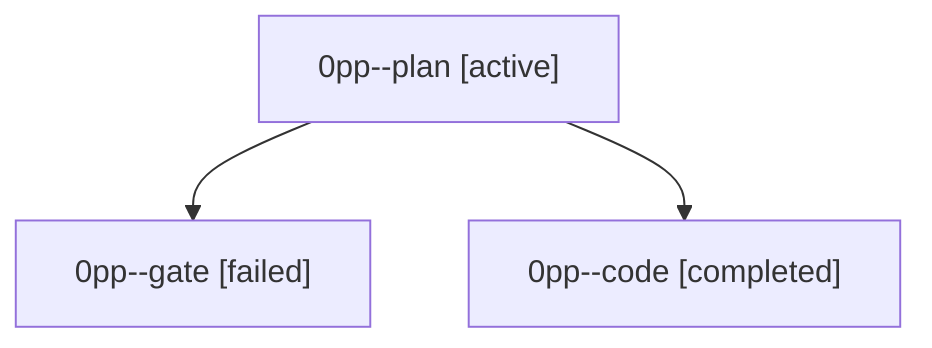

# Family: 0pp

[Agent Hoods](../README.md) / [bbugyi200](../users/bbugyi200/README.md) / [athena](../users/bbugyi200/machines/athena/README.md) / [0pp](../users/bbugyi200/machines/athena/hoods/0pp/README.md) / 0pp

Owner: `bbugyi200.athena` · Hood: `0pp` · Members: 3

## Lineage

The diagram is an optional enhancement; the ordered table below contains the same lineage in accessible text.

| Role | Agent | State | Model / provider | Timing | Commits | Prompt | Chat |
|---|---|---|---|---|---:|---|---|
| plan | 0pp--plan | active | opus / claude | 2026-09-22T22:34:18.925806+00:00 | 0 | [Prompt](../agents/bbugyi200.athena.0pp--plan/prompt.md) | [Chat](../agents/bbugyi200.athena.0pp--plan/chat.md) |
| gate | 0pp--gate | failed | opus / claude | 2026-09-22T22:39:59.272994+00:00 → 2026-09-22T22:41:02.738544+00:00 | 0 | — | [Chat](../agents/bbugyi200.athena.0pp--gate/chat.md) |
| code | 0pp--code | completed | muse-spark-1.3-contributor / muse | 2026-09-22T22:41:34.482194+00:00 → 2026-09-22T23:35:55.865651+00:00 | [1](../agents/bbugyi200.athena.0pp--code/README.md#commits) | [Prompt](../agents/bbugyi200.athena.0pp--code/prompt.md) | [Chat](../agents/bbugyi200.athena.0pp--code/chat.md) |

## Commits

| Role | Repo | Commit | Subject | Committed |
|---|---|---|---|---|
| code | sase | [`8c89951`](https://github.com/sase-org/sase/commit/8c89951644a32818908645aa7bd26dd264d48974) | feat(agents): keep sticky agent header visible in file/LLM Calls-only layout | 2026-09-22 19:28:36 EDT |
