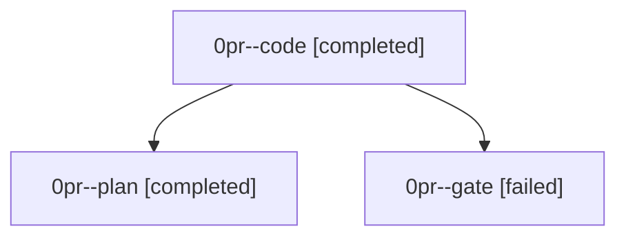

# Family: 0pr

[Agent Hoods](../README.md) / [bbugyi200](../users/bbugyi200/README.md) / [athena](../users/bbugyi200/machines/athena/README.md) / [0pr](../users/bbugyi200/machines/athena/hoods/0pr/README.md) / 0pr

Owner: `bbugyi200.athena` · Hood: `0pr` · Members: 3

## Lineage

The diagram is an optional enhancement; the ordered table below contains the same lineage in accessible text.

| Role | Agent | State | Model / provider | Timing | Commits | Prompt | Chat |
|---|---|---|---|---|---:|---|---|
| code | 0pr--code | completed | muse-spark-1.3-contributor / muse | 2026-09-23T12:22:29.582823+00:00 → 2026-09-23T12:42:04.956841+00:00 | 0 | — | [Chat](../agents/bbugyi200.athena.0pr--code/chat.md) |
| plan | 0pr--plan | completed | opus / claude | 2026-09-23T12:19:09.608384+00:00 → 2026-09-23T12:42:04.956841+00:00 | 0 | [Prompt](../agents/bbugyi200.athena.0pr--plan/prompt.md) | [Chat](../agents/bbugyi200.athena.0pr--plan/chat.md) |
| gate | 0pr--gate | failed | opus / claude | 2026-09-23T12:21:51.222677+00:00 → 2026-09-23T12:22:08.806434+00:00 | 0 | — | [Chat](../agents/bbugyi200.athena.0pr--gate/chat.md) |
