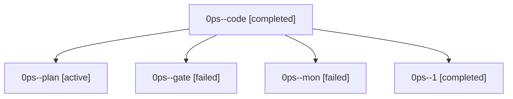

# Family: 0ps

[Agent Hoods](../README.md) / [bbugyi200](../users/bbugyi200/README.md) / [athena](../users/bbugyi200/machines/athena/README.md) / [0ps](../users/bbugyi200/machines/athena/hoods/0ps/README.md) / 0ps

Owner: `bbugyi200.athena` · Hood: `0ps` · Members: 5

## Lineage

The diagram is an optional enhancement; the ordered table below contains the same lineage in accessible text.

| Role | Agent | State | Model / provider | Timing | Commits | Prompt | Chat |
|---|---|---|---|---|---:|---|---|
| code | 0ps--code | completed | muse-spark-1.3-contributor / muse | 2026-09-23T12:54:09.981511+00:00 → 2026-09-23T13:50:03.169695+00:00 | 0 | — | [Chat](../agents/bbugyi200.athena.0ps--code/chat.md) |
| plan | 0ps--plan | active | opus / claude | 2026-09-23T12:49:44.401627+00:00 | 0 | [Prompt](../agents/bbugyi200.athena.0ps--plan/prompt.md) | [Chat](../agents/bbugyi200.athena.0ps--plan/chat.md) |
| gate | 0ps--gate | failed | opus / claude | 2026-09-23T12:53:25.110655+00:00 → 2026-09-23T12:53:44.603085+00:00 | 0 | — | [Chat](../agents/bbugyi200.athena.0ps--gate/chat.md) |
| mon | 0ps--mon | failed | muse-spark-1.3-contributor / muse | 2026-09-23T13:49:32.791431+00:00 → 2026-09-23T13:52:25.151225+00:00 | 0 | — | [Chat](../agents/bbugyi200.athena.0ps--mon/chat.md) |
| 1 | 0ps--1 | completed | muse-spark-1.3-contributor / muse | 2026-09-23T13:52:25.206077+00:00 → 2026-09-23T14:00:06.793515+00:00 | [1](../agents/bbugyi200.athena.0ps--1/README.md#commits) | [Prompt](../agents/bbugyi200.athena.0ps--1/prompt.md) | [Chat](../agents/bbugyi200.athena.0ps--1/chat.md) |

## Commits

| Role | Repo | Commit | Subject | Committed |
|---|---|---|---|---|
| 1 | sase | [`24d5e20`](https://github.com/sase-org/sase/commit/24d5e20afb21c0d4c3b0baf477e5d19616210e05) | feat(ace): add clan sticky header with detached identity panel | 2026-09-23 09:58:51 EDT |
