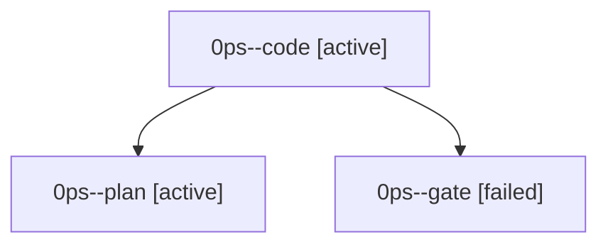

# Family: 0ps

[Agent Hoods](../README.md) / [bbugyi200](../users/bbugyi200/README.md) / [athena](../users/bbugyi200/machines/athena/README.md) / [0ps](../users/bbugyi200/machines/athena/hoods/0ps/README.md) / 0ps

Owner: `bbugyi200.athena` · Hood: `0ps` · Members: 3

## Lineage

The diagram is an optional enhancement; the ordered table below contains the same lineage in accessible text.

| Role | Agent | State | Model / provider | Timing | Commits | Prompt | Chat |
|---|---|---|---|---|---:|---|---|
| code | 0ps--code | active | muse-spark-1.3-contributor / muse | 2026-09-23T12:54:09.981511+00:00 | 0 | — | — |
| plan | 0ps--plan | active | opus / claude | 2026-09-23T12:49:44.401627+00:00 | 0 | [Prompt](../agents/bbugyi200.athena.0ps--plan/prompt.md) | [Chat](../agents/bbugyi200.athena.0ps--plan/chat.md) |
| gate | 0ps--gate | failed | opus / claude | 2026-09-23T12:53:25.110655+00:00 → 2026-09-23T12:53:44.603085+00:00 | 0 | — | [Chat](../agents/bbugyi200.athena.0ps--gate/chat.md) |
